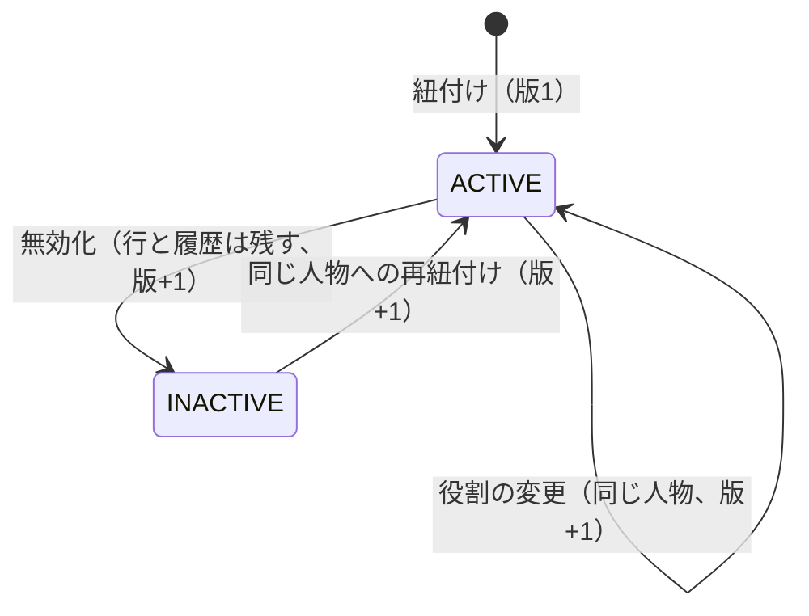
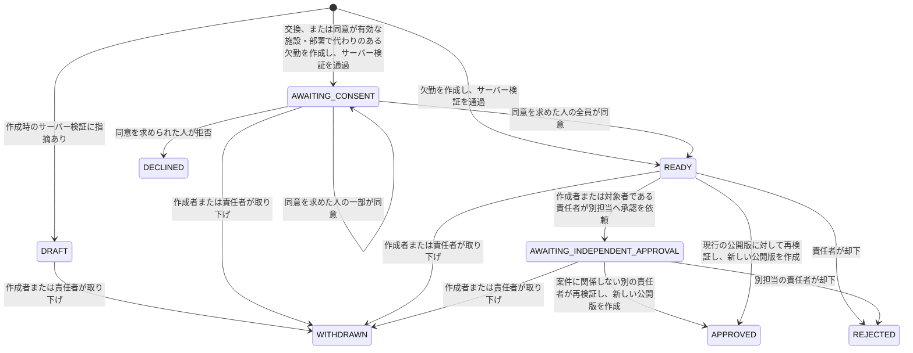
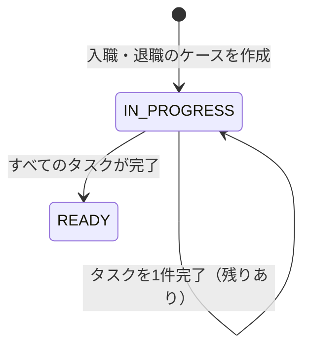

# 理想UIの業務状態（コードの遷移表から生成）

`PYTHONPATH=src:. python -m devtools.er.states --write` で生成する。手で編集しない。
ここにない遷移はコードにない。図の読み上げは題と説明だけなので、各図の下に同じ内容の表を置く。

## 本人アカウントの紐付け

| 遷移前 | 遷移後 | 条件 |
|---|---|---|
| （作成） | ACTIVE | 紐付け（版1） |
| ACTIVE | ACTIVE | 役割の変更（同じ人物、版+1） |
| ACTIVE | INACTIVE | 無効化（行と履歴は残す、版+1） |
| INACTIVE | ACTIVE | 同じ人物への再紐付け（版+1） |

## 欠勤・勤務交換のケース

| 遷移前 | 遷移後 | 条件 |
|---|---|---|
| （作成） | DRAFT | 作成時のサーバー検証に指摘あり |
| （作成） | READY | 欠勤を作成し、サーバー検証を通過 |
| （作成） | AWAITING_CONSENT | 交換、または同意が有効な施設・部署で代わりのある欠勤を作成し、サーバー検証を通過 |
| AWAITING_CONSENT | AWAITING_CONSENT | 同意を求めた人の一部が同意 |
| AWAITING_CONSENT | READY | 同意を求めた人の全員が同意 |
| READY | AWAITING_INDEPENDENT_APPROVAL | 作成者または対象者である責任者が別担当へ承認を依頼 |
| AWAITING_INDEPENDENT_APPROVAL | APPROVED | 案件に関係しない別の責任者が再検証し、新しい公開版を作成 |
| READY | APPROVED | 現行の公開版に対して再検証し、新しい公開版を作成 |
| DRAFT | WITHDRAWN | 作成者または責任者が取り下げ |
| AWAITING_CONSENT | WITHDRAWN | 作成者または責任者が取り下げ |
| READY | WITHDRAWN | 作成者または責任者が取り下げ |
| AWAITING_INDEPENDENT_APPROVAL | WITHDRAWN | 作成者または責任者が取り下げ |
| AWAITING_CONSENT | DECLINED | 同意を求められた人が拒否 |
| READY | REJECTED | 責任者が却下 |
| AWAITING_INDEPENDENT_APPROVAL | REJECTED | 別担当の責任者が却下 |

## 入職・退職のケース

| 遷移前 | 遷移後 | 条件 |
|---|---|---|
| （作成） | IN_PROGRESS | 入職・退職のケースを作成 |
| IN_PROGRESS | IN_PROGRESS | タスクを1件完了（残りあり） |
| IN_PROGRESS | READY | すべてのタスクが完了 |
