<!-- Generated by devtools/er/usecase_sequences.py. Do not edit. -->
# 理想UI・全27系列のシーケンス

`docs/ideal-ui/usecases.json` から生成する。API は OpenAPI で別途照合し、保存先は物理ER図と論理参照図で確認する。
図を読めない環境向けに、各図の直後へ同じ順序の表を置く。表名を物理FKとして解釈してはならない。

## U01 認証・役割・scope

経路: `/workspace/home` / 画面: `home/index` / 役割: ADMIN, LEADER, PHARMACIST / E2E: `ideal-u01-auth-scope`

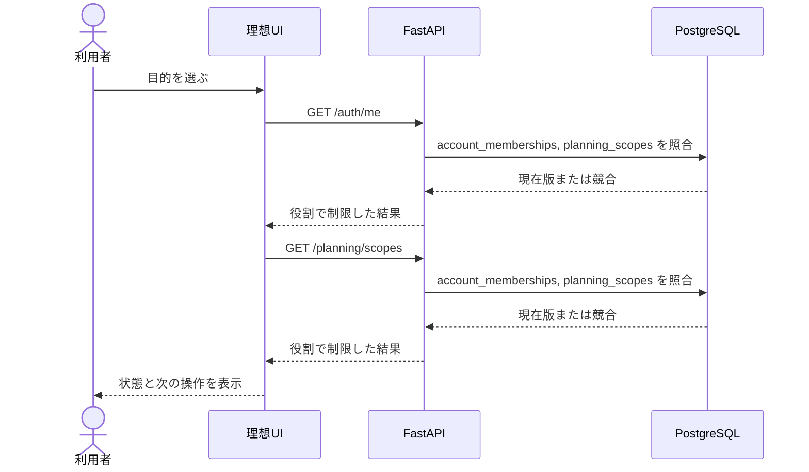
```mermaid
sequenceDiagram
  accTitle: U01 認証・役割・scope
  accDescr: /workspace/home からサーバー認可済みAPIを呼び、記録を読み書きして結果を表示する。
  actor User as 利用者
  participant UI as 理想UI
  participant API as FastAPI
  participant DB as PostgreSQL
  User->>UI: 目的を選ぶ
  UI->>API: GET /auth/me
  API->>DB: account_memberships, planning_scopes を照合
  DB-->>API: 現在版または競合
  API-->>UI: 役割で制限した結果
  UI->>API: GET /planning/scopes
  API->>DB: account_memberships, planning_scopes を照合
  DB-->>API: 現在版または競合
  API-->>UI: 役割で制限した結果
  UI-->>User: 状態と次の操作を表示
```

| 順序 | 主体 | 操作 | 検証可能な記録 |
|---:|---|---|---|
| 1 | 利用者 → UI | /workspace/home で目的を選択 | 画面状態: ready, empty, unauthenticated, forbidden |
| 2 | UI → API → DB | GET /auth/me | account_memberships, planning_scopes |
| 3 | UI → API → DB | GET /planning/scopes | account_memberships, planning_scopes |
| 4 | API → UI | 認可済み結果、または区別された失敗 | 監査: なし |
| 5 | UI → 関連画面 | 列挙済み遷移だけを生成 | /workspace/operations/cases, /workspace/schedule |

## U02 本人勤務と個人出力

経路: `/workspace/schedule` / 画面: `schedule/index` / 役割: ADMIN, LEADER, PHARMACIST / E2E: `ideal-u02-personal-schedule`

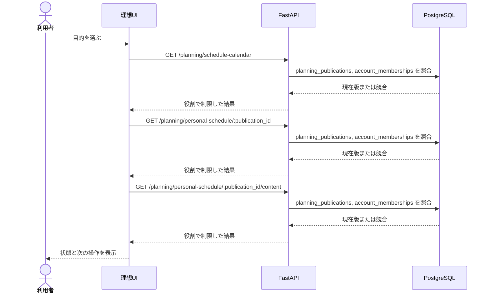
```mermaid
sequenceDiagram
  accTitle: U02 本人勤務と個人出力
  accDescr: /workspace/schedule からサーバー認可済みAPIを呼び、記録を読み書きして結果を表示する。
  actor User as 利用者
  participant UI as 理想UI
  participant API as FastAPI
  participant DB as PostgreSQL
  User->>UI: 目的を選ぶ
  UI->>API: GET /planning/schedule-calendar
  API->>DB: planning_publications, account_memberships を照合
  DB-->>API: 現在版または競合
  API-->>UI: 役割で制限した結果
  UI->>API: GET /planning/personal-schedule/:publication_id
  API->>DB: planning_publications, account_memberships を照合
  DB-->>API: 現在版または競合
  API-->>UI: 役割で制限した結果
  UI->>API: GET /planning/personal-schedule/:publication_id/content
  API->>DB: planning_publications, account_memberships を照合
  DB-->>API: 現在版または競合
  API-->>UI: 役割で制限した結果
  UI-->>User: 状態と次の操作を表示
```

| 順序 | 主体 | 操作 | 検証可能な記録 |
|---:|---|---|---|
| 1 | 利用者 → UI | /workspace/schedule で目的を選択 | 画面状態: ready, empty, conflict, forbidden |
| 2 | UI → API → DB | GET /planning/schedule-calendar | planning_publications, account_memberships |
| 3 | UI → API → DB | GET /planning/personal-schedule/{publication_id} | planning_publications, account_memberships |
| 4 | UI → API → DB | GET /planning/personal-schedule/{publication_id}/content | planning_publications, account_memberships |
| 5 | API → UI | 認可済み結果、または区別された失敗 | 監査: なし |
| 6 | UI → 関連画面 | 列挙済み遷移だけを生成 | /workspace/requests/leave, /workspace/requests/swap, /workspace/operations/cases |

## U03 三候補生成・比較・公開

経路: `/workspace/plan/compare` / 画面: `plan/compare` / 役割: ADMIN, LEADER / E2E: `ideal-u03-plan-publish`

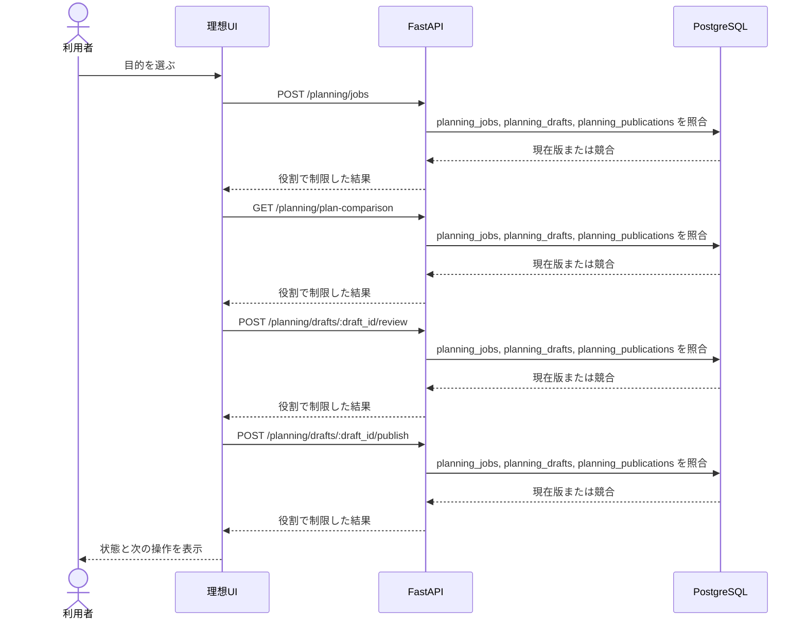
```mermaid
sequenceDiagram
  accTitle: U03 三候補生成・比較・公開
  accDescr: /workspace/plan/compare からサーバー認可済みAPIを呼び、記録を読み書きして結果を表示する。
  actor User as 利用者
  participant UI as 理想UI
  participant API as FastAPI
  participant DB as PostgreSQL
  User->>UI: 目的を選ぶ
  UI->>API: POST /planning/jobs
  API->>DB: planning_jobs, planning_drafts, planning_publications を照合
  DB-->>API: 現在版または競合
  API-->>UI: 役割で制限した結果
  UI->>API: GET /planning/plan-comparison
  API->>DB: planning_jobs, planning_drafts, planning_publications を照合
  DB-->>API: 現在版または競合
  API-->>UI: 役割で制限した結果
  UI->>API: POST /planning/drafts/:draft_id/review
  API->>DB: planning_jobs, planning_drafts, planning_publications を照合
  DB-->>API: 現在版または競合
  API-->>UI: 役割で制限した結果
  UI->>API: POST /planning/drafts/:draft_id/publish
  API->>DB: planning_jobs, planning_drafts, planning_publications を照合
  DB-->>API: 現在版または競合
  API-->>UI: 役割で制限した結果
  UI-->>User: 状態と次の操作を表示
```

| 順序 | 主体 | 操作 | 検証可能な記録 |
|---:|---|---|---|
| 1 | 利用者 → UI | /workspace/plan/compare で目的を選択 | 画面状態: ready, loading, failure, conflict |
| 2 | UI → API → DB | POST /planning/jobs | planning_jobs, planning_drafts, planning_publications |
| 3 | UI → API → DB | GET /planning/plan-comparison | planning_jobs, planning_drafts, planning_publications |
| 4 | UI → API → DB | POST /planning/drafts/{draft_id}/review | planning_jobs, planning_drafts, planning_publications |
| 5 | UI → API → DB | POST /planning/drafts/{draft_id}/publish | planning_jobs, planning_drafts, planning_publications |
| 6 | API → UI | 認可済み結果、または区別された失敗 | 監査: schedule.published |
| 7 | UI → 関連画面 | 列挙済み遷移だけを生成 | /workspace/plan/input, /workspace/plan/generate, /workspace/plan/compare, /workspace/plan/drafts, /workspace/plan/publications, /workspace/schedule |

## U04 古い入力の更新

経路: `/workspace/plan/input` / 画面: `plan/input` / 役割: ADMIN / E2E: `ideal-u04-stale-input`

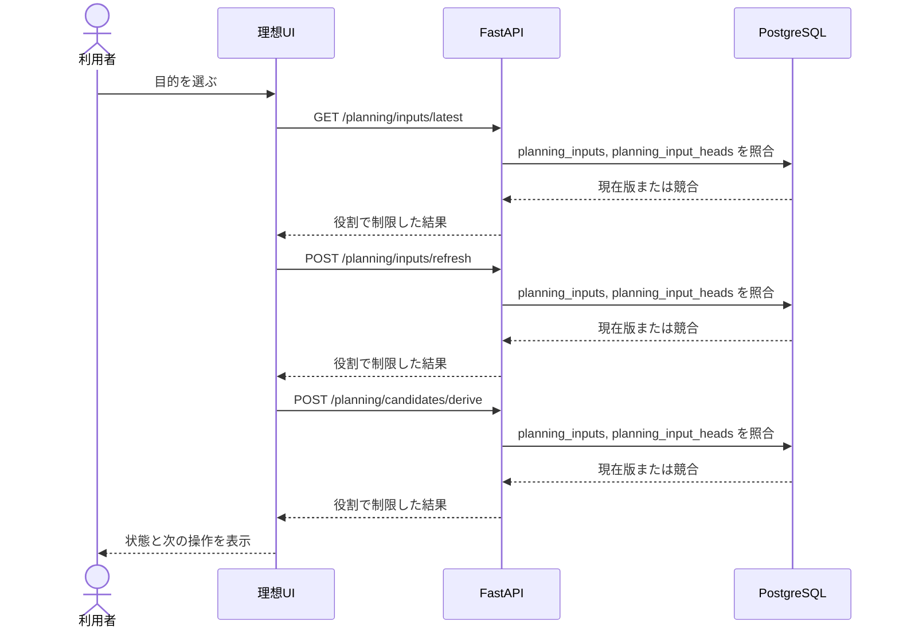
```mermaid
sequenceDiagram
  accTitle: U04 古い入力の更新
  accDescr: /workspace/plan/input からサーバー認可済みAPIを呼び、記録を読み書きして結果を表示する。
  actor User as 利用者
  participant UI as 理想UI
  participant API as FastAPI
  participant DB as PostgreSQL
  User->>UI: 目的を選ぶ
  UI->>API: GET /planning/inputs/latest
  API->>DB: planning_inputs, planning_input_heads を照合
  DB-->>API: 現在版または競合
  API-->>UI: 役割で制限した結果
  UI->>API: POST /planning/inputs/refresh
  API->>DB: planning_inputs, planning_input_heads を照合
  DB-->>API: 現在版または競合
  API-->>UI: 役割で制限した結果
  UI->>API: POST /planning/candidates/derive
  API->>DB: planning_inputs, planning_input_heads を照合
  DB-->>API: 現在版または競合
  API-->>UI: 役割で制限した結果
  UI-->>User: 状態と次の操作を表示
```

| 順序 | 主体 | 操作 | 検証可能な記録 |
|---:|---|---|---|
| 1 | 利用者 → UI | /workspace/plan/input で目的を選択 | 画面状態: ready, stale, conflict |
| 2 | UI → API → DB | GET /planning/inputs/latest | planning_inputs, planning_input_heads |
| 3 | UI → API → DB | POST /planning/inputs/refresh | planning_inputs, planning_input_heads |
| 4 | UI → API → DB | POST /planning/candidates/derive | planning_inputs, planning_input_heads |
| 5 | API → UI | 認可済み結果、または区別された失敗 | 監査: candidates.derived |
| 6 | UI → 関連画面 | 列挙済み遷移だけを生成 | /workspace/plan/input, /workspace/plan/generate, /workspace/plan/compare, /workspace/plan/drafts, /workspace/plan/publications, /workspace/schedule |

## U05 同意不要の欠勤

経路: `/workspace/operations/cases` / 画面: `operations/cases` / 役割: ADMIN, LEADER / E2E: `ideal-u05-absence`

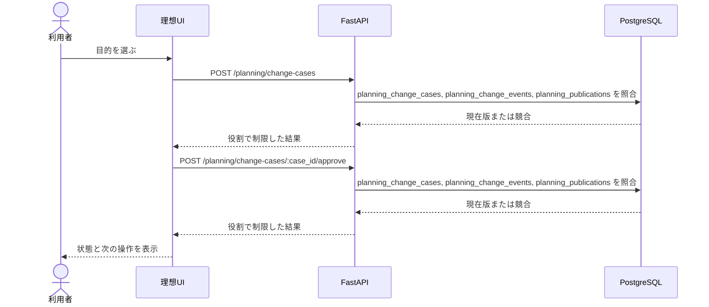
```mermaid
sequenceDiagram
  accTitle: U05 同意不要の欠勤
  accDescr: /workspace/operations/cases からサーバー認可済みAPIを呼び、記録を読み書きして結果を表示する。
  actor User as 利用者
  participant UI as 理想UI
  participant API as FastAPI
  participant DB as PostgreSQL
  User->>UI: 目的を選ぶ
  UI->>API: POST /planning/change-cases
  API->>DB: planning_change_cases, planning_change_events, planning_publications を照合
  DB-->>API: 現在版または競合
  API-->>UI: 役割で制限した結果
  UI->>API: POST /planning/change-cases/:case_id/approve
  API->>DB: planning_change_cases, planning_change_events, planning_publications を照合
  DB-->>API: 現在版または競合
  API-->>UI: 役割で制限した結果
  UI-->>User: 状態と次の操作を表示
```

| 順序 | 主体 | 操作 | 検証可能な記録 |
|---:|---|---|---|
| 1 | 利用者 → UI | /workspace/operations/cases で目的を選択 | 画面状態: ready, awaiting_independent_approval, approved, conflict |
| 2 | UI → API → DB | POST /planning/change-cases | planning_change_cases, planning_change_events, planning_publications |
| 3 | UI → API → DB | POST /planning/change-cases/{case_id}/approve | planning_change_cases, planning_change_events, planning_publications |
| 4 | API → UI | 認可済み結果、または区別された失敗 | 監査: change.absence.created, change.approved |
| 5 | UI → 関連画面 | 列挙済み遷移だけを生成 | /workspace/home, /workspace/schedule, /workspace/governance/audit |

## U06 勤務交換と同意

経路: `/workspace/requests/swap` / 画面: `requests/swap` / 役割: ADMIN, LEADER, PHARMACIST / E2E: `ideal-u06-swap`

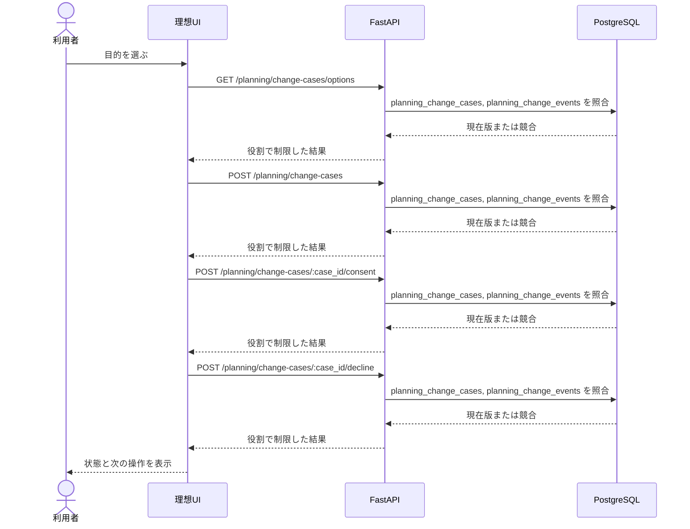
```mermaid
sequenceDiagram
  accTitle: U06 勤務交換と同意
  accDescr: /workspace/requests/swap からサーバー認可済みAPIを呼び、記録を読み書きして結果を表示する。
  actor User as 利用者
  participant UI as 理想UI
  participant API as FastAPI
  participant DB as PostgreSQL
  User->>UI: 目的を選ぶ
  UI->>API: GET /planning/change-cases/options
  API->>DB: planning_change_cases, planning_change_events を照合
  DB-->>API: 現在版または競合
  API-->>UI: 役割で制限した結果
  UI->>API: POST /planning/change-cases
  API->>DB: planning_change_cases, planning_change_events を照合
  DB-->>API: 現在版または競合
  API-->>UI: 役割で制限した結果
  UI->>API: POST /planning/change-cases/:case_id/consent
  API->>DB: planning_change_cases, planning_change_events を照合
  DB-->>API: 現在版または競合
  API-->>UI: 役割で制限した結果
  UI->>API: POST /planning/change-cases/:case_id/decline
  API->>DB: planning_change_cases, planning_change_events を照合
  DB-->>API: 現在版または競合
  API-->>UI: 役割で制限した結果
  UI-->>User: 状態と次の操作を表示
```

| 順序 | 主体 | 操作 | 検証可能な記録 |
|---:|---|---|---|
| 1 | 利用者 → UI | /workspace/requests/swap で目的を選択 | 画面状態: awaiting_consent, ready, declined |
| 2 | UI → API → DB | GET /planning/change-cases/options | planning_change_cases, planning_change_events |
| 3 | UI → API → DB | POST /planning/change-cases | planning_change_cases, planning_change_events |
| 4 | UI → API → DB | POST /planning/change-cases/{case_id}/consent | planning_change_cases, planning_change_events |
| 5 | UI → API → DB | POST /planning/change-cases/{case_id}/decline | planning_change_cases, planning_change_events |
| 6 | API → UI | 認可済み結果、または区別された失敗 | 監査: change.swap.created, change.swap.consented, change.swap.declined |
| 7 | UI → 関連画面 | 列挙済み遷移だけを生成 | /workspace/schedule, /workspace/operations/cases |

## U07 申請取下げ

経路: `/workspace/requests/mine` / 画面: `requests/mine` / 役割: ADMIN, LEADER, PHARMACIST / E2E: `ideal-u07-withdraw`

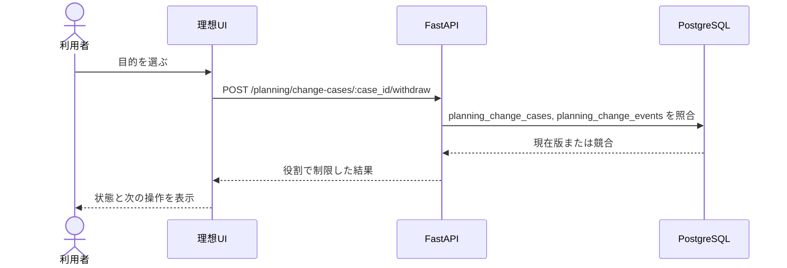
```mermaid
sequenceDiagram
  accTitle: U07 申請取下げ
  accDescr: /workspace/requests/mine からサーバー認可済みAPIを呼び、記録を読み書きして結果を表示する。
  actor User as 利用者
  participant UI as 理想UI
  participant API as FastAPI
  participant DB as PostgreSQL
  User->>UI: 目的を選ぶ
  UI->>API: POST /planning/change-cases/:case_id/withdraw
  API->>DB: planning_change_cases, planning_change_events を照合
  DB-->>API: 現在版または競合
  API-->>UI: 役割で制限した結果
  UI-->>User: 状態と次の操作を表示
```

| 順序 | 主体 | 操作 | 検証可能な記録 |
|---:|---|---|---|
| 1 | 利用者 → UI | /workspace/requests/mine で目的を選択 | 画面状態: ready, withdrawn, conflict |
| 2 | UI → API → DB | POST /planning/change-cases/{case_id}/withdraw | planning_change_cases, planning_change_events |
| 3 | API → UI | 認可済み結果、または区別された失敗 | 監査: change.withdrawn |
| 4 | UI → 関連画面 | 列挙済み遷移だけを生成 | /workspace/schedule, /workspace/operations/cases |

## U08 欠勤同意設定

経路: `/workspace/settings/absence-consent` / 画面: `settings/absence-consent` / 役割: ADMIN, LEADER, PHARMACIST / E2E: `ideal-u08-absence-consent`

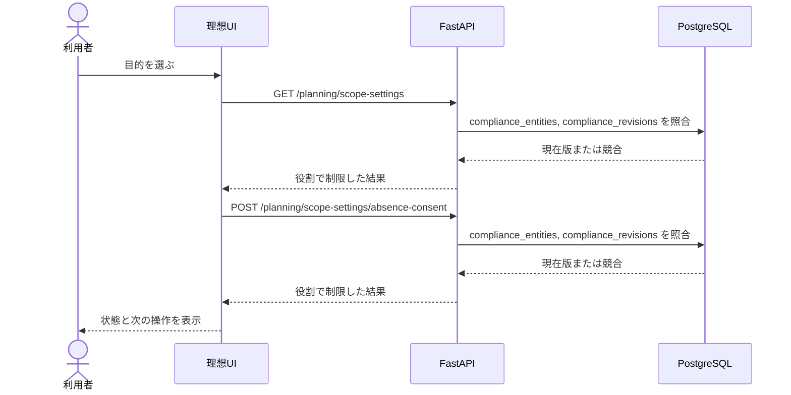
```mermaid
sequenceDiagram
  accTitle: U08 欠勤同意設定
  accDescr: /workspace/settings/absence-consent からサーバー認可済みAPIを呼び、記録を読み書きして結果を表示する。
  actor User as 利用者
  participant UI as 理想UI
  participant API as FastAPI
  participant DB as PostgreSQL
  User->>UI: 目的を選ぶ
  UI->>API: GET /planning/scope-settings
  API->>DB: compliance_entities, compliance_revisions を照合
  DB-->>API: 現在版または競合
  API-->>UI: 役割で制限した結果
  UI->>API: POST /planning/scope-settings/absence-consent
  API->>DB: compliance_entities, compliance_revisions を照合
  DB-->>API: 現在版または競合
  API-->>UI: 役割で制限した結果
  UI-->>User: 状態と次の操作を表示
```

| 順序 | 主体 | 操作 | 検証可能な記録 |
|---:|---|---|---|
| 1 | 利用者 → UI | /workspace/settings/absence-consent で目的を選択 | 画面状態: enabled, disabled, forbidden, conflict |
| 2 | UI → API → DB | GET /planning/scope-settings | compliance_entities, compliance_revisions |
| 3 | UI → API → DB | POST /planning/scope-settings/absence-consent | compliance_entities, compliance_revisions |
| 4 | API → UI | 認可済み結果、または区別された失敗 | 監査: scope_setting.saved |
| 5 | UI → 関連画面 | 列挙済み遷移だけを生成 | /workspace/settings/appearance, /workspace/settings/notifications, /workspace/settings/absence-consent, /workspace/settings/flextime |

## U09 本人アカウント紐付け

経路: `/workspace/people/memberships` / 画面: `people/memberships` / 役割: ADMIN / E2E: `ideal-u09-membership-link`

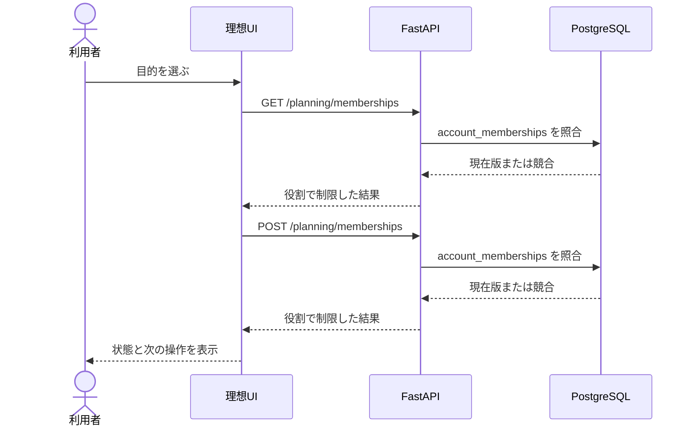
```mermaid
sequenceDiagram
  accTitle: U09 本人アカウント紐付け
  accDescr: /workspace/people/memberships からサーバー認可済みAPIを呼び、記録を読み書きして結果を表示する。
  actor User as 利用者
  participant UI as 理想UI
  participant API as FastAPI
  participant DB as PostgreSQL
  User->>UI: 目的を選ぶ
  UI->>API: GET /planning/memberships
  API->>DB: account_memberships を照合
  DB-->>API: 現在版または競合
  API-->>UI: 役割で制限した結果
  UI->>API: POST /planning/memberships
  API->>DB: account_memberships を照合
  DB-->>API: 現在版または競合
  API-->>UI: 役割で制限した結果
  UI-->>User: 状態と次の操作を表示
```

| 順序 | 主体 | 操作 | 検証可能な記録 |
|---:|---|---|---|
| 1 | 利用者 → UI | /workspace/people/memberships で目的を選択 | 画面状態: ready, validation, conflict |
| 2 | UI → API → DB | GET /planning/memberships | account_memberships |
| 3 | UI → API → DB | POST /planning/memberships | account_memberships |
| 4 | API → UI | 認可済み結果、または区別された失敗 | 監査: membership.linked |
| 5 | UI → 関連画面 | 列挙済み遷移だけを生成 | /workspace/people/directory, /workspace/people/memberships, /workspace/people/lifecycle, /workspace/people/contracts |

## U10 所属無効化

経路: `/workspace/people/memberships` / 画面: `people/memberships` / 役割: ADMIN / E2E: `ideal-u10-membership-deactivate`

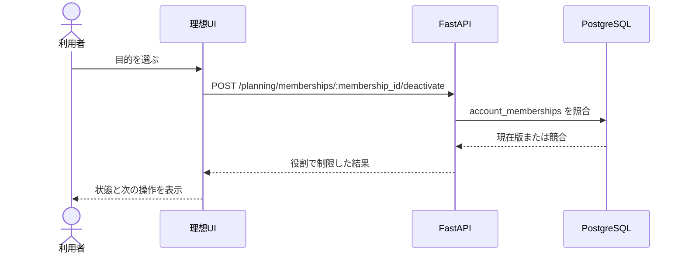
```mermaid
sequenceDiagram
  accTitle: U10 所属無効化
  accDescr: /workspace/people/memberships からサーバー認可済みAPIを呼び、記録を読み書きして結果を表示する。
  actor User as 利用者
  participant UI as 理想UI
  participant API as FastAPI
  participant DB as PostgreSQL
  User->>UI: 目的を選ぶ
  UI->>API: POST /planning/memberships/:membership_id/deactivate
  API->>DB: account_memberships を照合
  DB-->>API: 現在版または競合
  API-->>UI: 役割で制限した結果
  UI-->>User: 状態と次の操作を表示
```

| 順序 | 主体 | 操作 | 検証可能な記録 |
|---:|---|---|---|
| 1 | 利用者 → UI | /workspace/people/memberships で目的を選択 | 画面状態: ready, self_blocked, last_admin_blocked, inactive |
| 2 | UI → API → DB | POST /planning/memberships/{membership_id}/deactivate | account_memberships |
| 3 | API → UI | 認可済み結果、または区別された失敗 | 監査: membership.deactivated |
| 4 | UI → 関連画面 | 列挙済み遷移だけを生成 | /workspace/people/directory, /workspace/people/memberships, /workspace/people/lifecycle, /workspace/people/contracts |

## U11 入職タスク

経路: `/workspace/people/lifecycle` / 画面: `people/lifecycle` / 役割: ADMIN / E2E: `ideal-u11-onboarding`

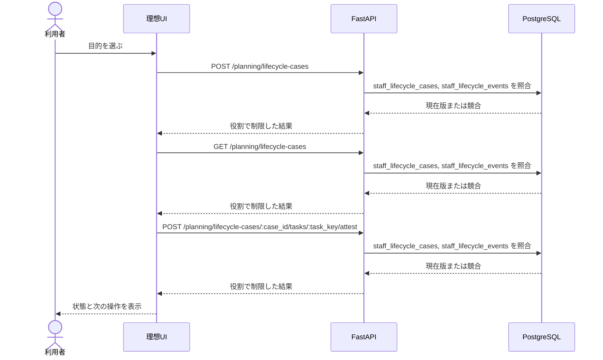
```mermaid
sequenceDiagram
  accTitle: U11 入職タスク
  accDescr: /workspace/people/lifecycle からサーバー認可済みAPIを呼び、記録を読み書きして結果を表示する。
  actor User as 利用者
  participant UI as 理想UI
  participant API as FastAPI
  participant DB as PostgreSQL
  User->>UI: 目的を選ぶ
  UI->>API: POST /planning/lifecycle-cases
  API->>DB: staff_lifecycle_cases, staff_lifecycle_events を照合
  DB-->>API: 現在版または競合
  API-->>UI: 役割で制限した結果
  UI->>API: GET /planning/lifecycle-cases
  API->>DB: staff_lifecycle_cases, staff_lifecycle_events を照合
  DB-->>API: 現在版または競合
  API-->>UI: 役割で制限した結果
  UI->>API: POST /planning/lifecycle-cases/:case_id/tasks/:task_key/attest
  API->>DB: staff_lifecycle_cases, staff_lifecycle_events を照合
  DB-->>API: 現在版または競合
  API-->>UI: 役割で制限した結果
  UI-->>User: 状態と次の操作を表示
```

| 順序 | 主体 | 操作 | 検証可能な記録 |
|---:|---|---|---|
| 1 | 利用者 → UI | /workspace/people/lifecycle で目的を選択 | 画面状態: in_progress, ready |
| 2 | UI → API → DB | POST /planning/lifecycle-cases | staff_lifecycle_cases, staff_lifecycle_events |
| 3 | UI → API → DB | GET /planning/lifecycle-cases | staff_lifecycle_cases, staff_lifecycle_events |
| 4 | UI → API → DB | POST /planning/lifecycle-cases/{case_id}/tasks/{task_key}/attest | staff_lifecycle_cases, staff_lifecycle_events |
| 5 | API → UI | 認可済み結果、または区別された失敗 | 監査: lifecycle.onboard.created, lifecycle.task.completed |
| 6 | UI → 関連画面 | 列挙済み遷移だけを生成 | /workspace/people/directory, /workspace/people/memberships, /workspace/people/lifecycle, /workspace/people/contracts |

## U12 退職タスク

経路: `/workspace/people/lifecycle` / 画面: `people/lifecycle` / 役割: ADMIN / E2E: `ideal-u12-offboarding`

```mermaid
sequenceDiagram
  accTitle: U12 退職タスク
  accDescr: /workspace/people/lifecycle からサーバー認可済みAPIを呼び、記録を読み書きして結果を表示する。
  actor User as 利用者
  participant UI as 理想UI
  participant API as FastAPI
  participant DB as PostgreSQL
  User->>UI: 目的を選ぶ
  UI->>API: POST /planning/lifecycle-cases
  API->>DB: staff_lifecycle_cases, staff_lifecycle_events を照合
  DB-->>API: 現在版または競合
  API-->>UI: 役割で制限した結果
  UI->>API: GET /planning/lifecycle-cases
  API->>DB: staff_lifecycle_cases, staff_lifecycle_events を照合
  DB-->>API: 現在版または競合
  API-->>UI: 役割で制限した結果
  UI->>API: POST /planning/lifecycle-cases/:case_id/tasks/:task_key/attest
  API->>DB: staff_lifecycle_cases, staff_lifecycle_events を照合
  DB-->>API: 現在版または競合
  API-->>UI: 役割で制限した結果
  UI-->>User: 状態と次の操作を表示
```

| 順序 | 主体 | 操作 | 検証可能な記録 |
|---:|---|---|---|
| 1 | 利用者 → UI | /workspace/people/lifecycle で目的を選択 | 画面状態: in_progress, ready |
| 2 | UI → API → DB | POST /planning/lifecycle-cases | staff_lifecycle_cases, staff_lifecycle_events |
| 3 | UI → API → DB | GET /planning/lifecycle-cases | staff_lifecycle_cases, staff_lifecycle_events |
| 4 | UI → API → DB | POST /planning/lifecycle-cases/{case_id}/tasks/{task_key}/attest | staff_lifecycle_cases, staff_lifecycle_events |
| 5 | API → UI | 認可済み結果、または区別された失敗 | 監査: lifecycle.offboard.created, lifecycle.task.completed |
| 6 | UI → 関連画面 | 列挙済み遷移だけを生成 | /workspace/people/directory, /workspace/people/memberships, /workspace/people/lifecycle, /workspace/people/contracts |

## U13 監査タイムライン

経路: `/workspace/governance/audit` / 画面: `governance/audit` / 役割: ADMIN / E2E: `ideal-u13-audit`

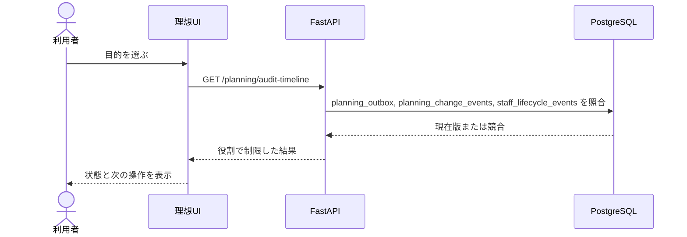
```mermaid
sequenceDiagram
  accTitle: U13 監査タイムライン
  accDescr: /workspace/governance/audit からサーバー認可済みAPIを呼び、記録を読み書きして結果を表示する。
  actor User as 利用者
  participant UI as 理想UI
  participant API as FastAPI
  participant DB as PostgreSQL
  User->>UI: 目的を選ぶ
  UI->>API: GET /planning/audit-timeline
  API->>DB: planning_outbox, planning_change_events, staff_lifecycle_events を照合
  DB-->>API: 現在版または競合
  API-->>UI: 役割で制限した結果
  UI-->>User: 状態と次の操作を表示
```

| 順序 | 主体 | 操作 | 検証可能な記録 |
|---:|---|---|---|
| 1 | 利用者 → UI | /workspace/governance/audit で目的を選択 | 画面状態: ready, empty, failure |
| 2 | UI → API → DB | GET /planning/audit-timeline | planning_outbox, planning_change_events, staff_lifecycle_events |
| 3 | API → UI | 認可済み結果、または区別された失敗 | 監査: なし |
| 4 | UI → 関連画面 | 列挙済み遷移だけを生成 | /workspace/governance/audit, /workspace/governance/actuals, /workspace/governance/privacy, /workspace/governance/recovery |

## U14 異常系と再送

経路: `/workspace/home` / 画面: `home/index` / 役割: ADMIN, LEADER, PHARMACIST / E2E: `ideal-u14-failure-retry`

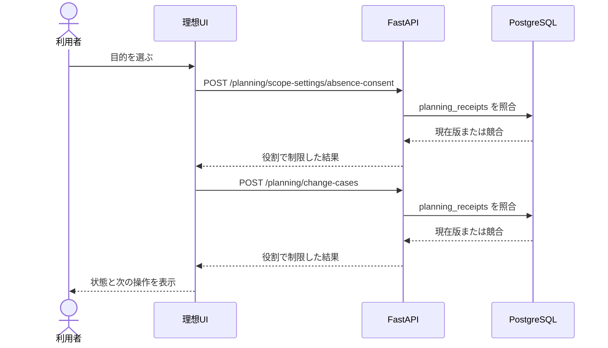
```mermaid
sequenceDiagram
  accTitle: U14 異常系と再送
  accDescr: /workspace/home からサーバー認可済みAPIを呼び、記録を読み書きして結果を表示する。
  actor User as 利用者
  participant UI as 理想UI
  participant API as FastAPI
  participant DB as PostgreSQL
  User->>UI: 目的を選ぶ
  UI->>API: POST /planning/scope-settings/absence-consent
  API->>DB: planning_receipts を照合
  DB-->>API: 現在版または競合
  API-->>UI: 役割で制限した結果
  UI->>API: POST /planning/change-cases
  API->>DB: planning_receipts を照合
  DB-->>API: 現在版または競合
  API-->>UI: 役割で制限した結果
  UI-->>User: 状態と次の操作を表示
```

| 順序 | 主体 | 操作 | 検証可能な記録 |
|---:|---|---|---|
| 1 | 利用者 → UI | /workspace/home で目的を選択 | 画面状態: unauthenticated, forbidden, validation, conflict, unknown, partial_failure |
| 2 | UI → API → DB | POST /planning/scope-settings/absence-consent | planning_receipts |
| 3 | UI → API → DB | POST /planning/change-cases | planning_receipts |
| 4 | API → UI | 認可済み結果、または区別された失敗 | 監査: なし |
| 5 | UI → 関連画面 | 列挙済み遷移だけを生成 | /workspace/operations/cases, /workspace/schedule |

## U15 月間勤務・版差分・部署出力

経路: `/workspace/schedule` / 画面: `schedule/index` / 役割: ADMIN, LEADER, PHARMACIST / E2E: `ideal-u15-monthly-schedule`

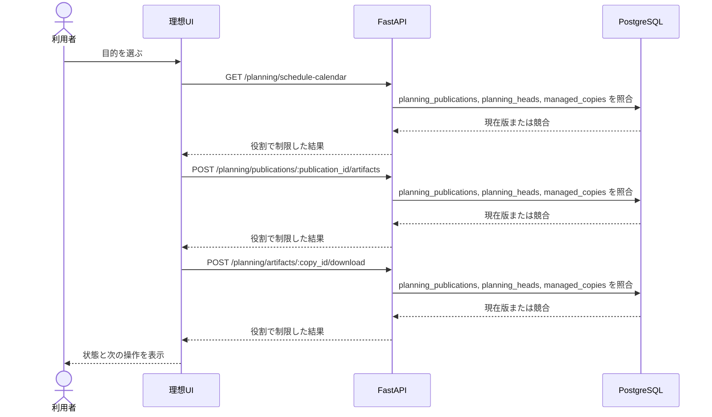
```mermaid
sequenceDiagram
  accTitle: U15 月間勤務・版差分・部署出力
  accDescr: /workspace/schedule からサーバー認可済みAPIを呼び、記録を読み書きして結果を表示する。
  actor User as 利用者
  participant UI as 理想UI
  participant API as FastAPI
  participant DB as PostgreSQL
  User->>UI: 目的を選ぶ
  UI->>API: GET /planning/schedule-calendar
  API->>DB: planning_publications, planning_heads, managed_copies を照合
  DB-->>API: 現在版または競合
  API-->>UI: 役割で制限した結果
  UI->>API: POST /planning/publications/:publication_id/artifacts
  API->>DB: planning_publications, planning_heads, managed_copies を照合
  DB-->>API: 現在版または競合
  API-->>UI: 役割で制限した結果
  UI->>API: POST /planning/artifacts/:copy_id/download
  API->>DB: planning_publications, planning_heads, managed_copies を照合
  DB-->>API: 現在版または競合
  API-->>UI: 役割で制限した結果
  UI-->>User: 状態と次の操作を表示
```

| 順序 | 主体 | 操作 | 検証可能な記録 |
|---:|---|---|---|
| 1 | 利用者 → UI | /workspace/schedule で目的を選択 | 画面状態: ready, empty, changed, self_only |
| 2 | UI → API → DB | GET /planning/schedule-calendar | planning_publications, planning_heads, managed_copies |
| 3 | UI → API → DB | POST /planning/publications/{publication_id}/artifacts | planning_publications, planning_heads, managed_copies |
| 4 | UI → API → DB | POST /planning/artifacts/{copy_id}/download | planning_publications, planning_heads, managed_copies |
| 5 | API → UI | 認可済み結果、または区別された失敗 | 監査: なし |
| 6 | UI → 関連画面 | 列挙済み遷移だけを生成 | /workspace/requests/leave, /workspace/requests/swap, /workspace/operations/cases |

## U16 当日運用

経路: `/workspace/operations/today` / 画面: `operations/today` / 役割: ADMIN, LEADER / E2E: `ideal-u16-daily-operations`

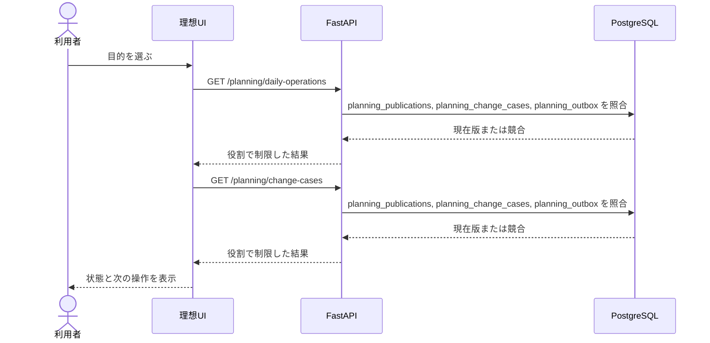
```mermaid
sequenceDiagram
  accTitle: U16 当日運用
  accDescr: /workspace/operations/today からサーバー認可済みAPIを呼び、記録を読み書きして結果を表示する。
  actor User as 利用者
  participant UI as 理想UI
  participant API as FastAPI
  participant DB as PostgreSQL
  User->>UI: 目的を選ぶ
  UI->>API: GET /planning/daily-operations
  API->>DB: planning_publications, planning_change_cases, planning_outbox を照合
  DB-->>API: 現在版または競合
  API-->>UI: 役割で制限した結果
  UI->>API: GET /planning/change-cases
  API->>DB: planning_publications, planning_change_cases, planning_outbox を照合
  DB-->>API: 現在版または競合
  API-->>UI: 役割で制限した結果
  UI-->>User: 状態と次の操作を表示
```

| 順序 | 主体 | 操作 | 検証可能な記録 |
|---:|---|---|---|
| 1 | 利用者 → UI | /workspace/operations/today で目的を選択 | 画面状態: ready, empty, warning, failure |
| 2 | UI → API → DB | GET /planning/daily-operations | planning_publications, planning_change_cases, planning_outbox |
| 3 | UI → API → DB | GET /planning/change-cases | planning_publications, planning_change_cases, planning_outbox |
| 4 | API → UI | 認可済み結果、または区別された失敗 | 監査: なし |
| 5 | UI → 関連画面 | 列挙済み遷移だけを生成 | /workspace/home, /workspace/schedule, /workspace/governance/audit |

## U17 役割別ホーム

経路: `/workspace/home` / 画面: `home/index` / 役割: ADMIN, LEADER, PHARMACIST / E2E: `ideal-u17-role-home`

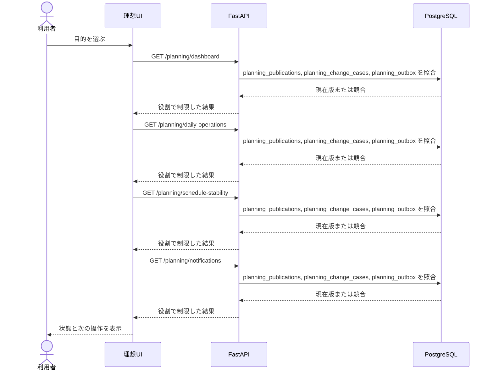
```mermaid
sequenceDiagram
  accTitle: U17 役割別ホーム
  accDescr: /workspace/home からサーバー認可済みAPIを呼び、記録を読み書きして結果を表示する。
  actor User as 利用者
  participant UI as 理想UI
  participant API as FastAPI
  participant DB as PostgreSQL
  User->>UI: 目的を選ぶ
  UI->>API: GET /planning/dashboard
  API->>DB: planning_publications, planning_change_cases, planning_outbox を照合
  DB-->>API: 現在版または競合
  API-->>UI: 役割で制限した結果
  UI->>API: GET /planning/daily-operations
  API->>DB: planning_publications, planning_change_cases, planning_outbox を照合
  DB-->>API: 現在版または競合
  API-->>UI: 役割で制限した結果
  UI->>API: GET /planning/schedule-stability
  API->>DB: planning_publications, planning_change_cases, planning_outbox を照合
  DB-->>API: 現在版または競合
  API-->>UI: 役割で制限した結果
  UI->>API: GET /planning/notifications
  API->>DB: planning_publications, planning_change_cases, planning_outbox を照合
  DB-->>API: 現在版または競合
  API-->>UI: 役割で制限した結果
  UI-->>User: 状態と次の操作を表示
```

| 順序 | 主体 | 操作 | 検証可能な記録 |
|---:|---|---|---|
| 1 | 利用者 → UI | /workspace/home で目的を選択 | 画面状態: ready, empty, failure |
| 2 | UI → API → DB | GET /planning/dashboard | planning_publications, planning_change_cases, planning_outbox |
| 3 | UI → API → DB | GET /planning/daily-operations | planning_publications, planning_change_cases, planning_outbox |
| 4 | UI → API → DB | GET /planning/schedule-stability | planning_publications, planning_change_cases, planning_outbox |
| 5 | UI → API → DB | GET /planning/notifications | planning_publications, planning_change_cases, planning_outbox |
| 6 | API → UI | 認可済み結果、または区別された失敗 | 監査: なし |
| 7 | UI → 関連画面 | 列挙済み遷移だけを生成 | /workspace/operations/cases, /workspace/schedule |

## U18 施設・個人設定

経路: `/workspace/settings/appearance` / 画面: `settings/appearance` / 役割: ADMIN, LEADER, PHARMACIST / E2E: `ideal-u18-settings`

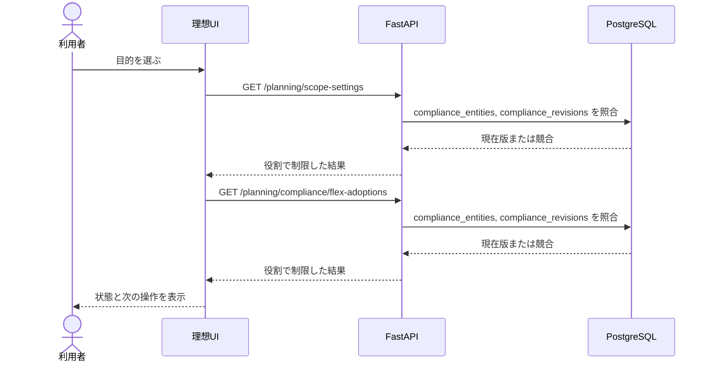
```mermaid
sequenceDiagram
  accTitle: U18 施設・個人設定
  accDescr: /workspace/settings/appearance からサーバー認可済みAPIを呼び、記録を読み書きして結果を表示する。
  actor User as 利用者
  participant UI as 理想UI
  participant API as FastAPI
  participant DB as PostgreSQL
  User->>UI: 目的を選ぶ
  UI->>API: GET /planning/scope-settings
  API->>DB: compliance_entities, compliance_revisions を照合
  DB-->>API: 現在版または競合
  API-->>UI: 役割で制限した結果
  UI->>API: GET /planning/compliance/flex-adoptions
  API->>DB: compliance_entities, compliance_revisions を照合
  DB-->>API: 現在版または競合
  API-->>UI: 役割で制限した結果
  UI-->>User: 状態と次の操作を表示
```

| 順序 | 主体 | 操作 | 検証可能な記録 |
|---:|---|---|---|
| 1 | 利用者 → UI | /workspace/settings/appearance で目的を選択 | 画面状態: ready, forbidden, conflict |
| 2 | UI → API → DB | GET /planning/scope-settings | compliance_entities, compliance_revisions |
| 3 | UI → API → DB | GET /planning/compliance/flex-adoptions | compliance_entities, compliance_revisions |
| 4 | API → UI | 認可済み結果、または区別された失敗 | 監査: なし |
| 5 | UI → 関連画面 | 列挙済み遷移だけを生成 | /workspace/settings/appearance, /workspace/settings/notifications, /workspace/settings/absence-consent, /workspace/settings/flextime |

## U19 休暇

経路: `/workspace/requests/leave` / 画面: `requests/leave` / 役割: ADMIN, LEADER, PHARMACIST / E2E: `ideal-u19-leave`

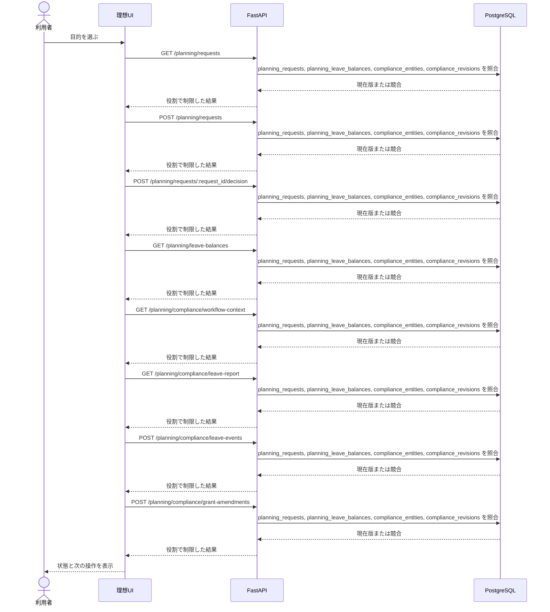
```mermaid
sequenceDiagram
  accTitle: U19 休暇
  accDescr: /workspace/requests/leave からサーバー認可済みAPIを呼び、記録を読み書きして結果を表示する。
  actor User as 利用者
  participant UI as 理想UI
  participant API as FastAPI
  participant DB as PostgreSQL
  User->>UI: 目的を選ぶ
  UI->>API: GET /planning/requests
  API->>DB: planning_requests, planning_leave_balances, compliance_entities, compliance_revisions を照合
  DB-->>API: 現在版または競合
  API-->>UI: 役割で制限した結果
  UI->>API: POST /planning/requests
  API->>DB: planning_requests, planning_leave_balances, compliance_entities, compliance_revisions を照合
  DB-->>API: 現在版または競合
  API-->>UI: 役割で制限した結果
  UI->>API: POST /planning/requests/:request_id/decision
  API->>DB: planning_requests, planning_leave_balances, compliance_entities, compliance_revisions を照合
  DB-->>API: 現在版または競合
  API-->>UI: 役割で制限した結果
  UI->>API: GET /planning/leave-balances
  API->>DB: planning_requests, planning_leave_balances, compliance_entities, compliance_revisions を照合
  DB-->>API: 現在版または競合
  API-->>UI: 役割で制限した結果
  UI->>API: GET /planning/compliance/workflow-context
  API->>DB: planning_requests, planning_leave_balances, compliance_entities, compliance_revisions を照合
  DB-->>API: 現在版または競合
  API-->>UI: 役割で制限した結果
  UI->>API: GET /planning/compliance/leave-report
  API->>DB: planning_requests, planning_leave_balances, compliance_entities, compliance_revisions を照合
  DB-->>API: 現在版または競合
  API-->>UI: 役割で制限した結果
  UI->>API: POST /planning/compliance/leave-events
  API->>DB: planning_requests, planning_leave_balances, compliance_entities, compliance_revisions を照合
  DB-->>API: 現在版または競合
  API-->>UI: 役割で制限した結果
  UI->>API: POST /planning/compliance/grant-amendments
  API->>DB: planning_requests, planning_leave_balances, compliance_entities, compliance_revisions を照合
  DB-->>API: 現在版または競合
  API-->>UI: 役割で制限した結果
  UI-->>User: 状態と次の操作を表示
```

| 順序 | 主体 | 操作 | 検証可能な記録 |
|---:|---|---|---|
| 1 | 利用者 → UI | /workspace/requests/leave で目的を選択 | 画面状態: ready, pending, approved, rejected, conflict |
| 2 | UI → API → DB | GET /planning/requests | planning_requests, planning_leave_balances, compliance_entities, compliance_revisions |
| 3 | UI → API → DB | POST /planning/requests | planning_requests, planning_leave_balances, compliance_entities, compliance_revisions |
| 4 | UI → API → DB | POST /planning/requests/{request_id}/decision | planning_requests, planning_leave_balances, compliance_entities, compliance_revisions |
| 5 | UI → API → DB | GET /planning/leave-balances | planning_requests, planning_leave_balances, compliance_entities, compliance_revisions |
| 6 | UI → API → DB | GET /planning/compliance/workflow-context | planning_requests, planning_leave_balances, compliance_entities, compliance_revisions |
| 7 | UI → API → DB | GET /planning/compliance/leave-report | planning_requests, planning_leave_balances, compliance_entities, compliance_revisions |
| 8 | UI → API → DB | POST /planning/compliance/leave-events | planning_requests, planning_leave_balances, compliance_entities, compliance_revisions |
| 9 | UI → API → DB | POST /planning/compliance/grant-amendments | planning_requests, planning_leave_balances, compliance_entities, compliance_revisions |
| 10 | API → UI | 認可済み結果、または区別された失敗 | 監査: request.created, request.decided |
| 11 | UI → 関連画面 | 列挙済み遷移だけを生成 | /workspace/schedule, /workspace/operations/cases |

## U20 契約・資格

経路: `/workspace/people/contracts` / 画面: `people/contracts` / 役割: ADMIN / E2E: `ideal-u20-contracts`

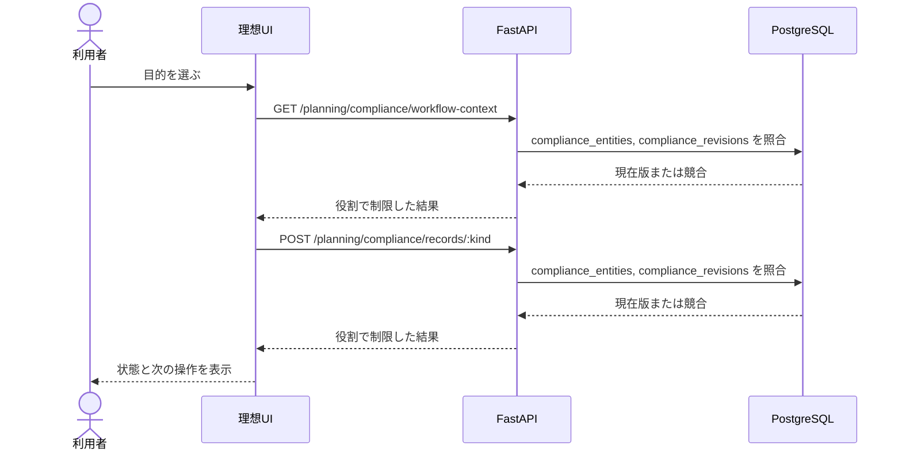
```mermaid
sequenceDiagram
  accTitle: U20 契約・資格
  accDescr: /workspace/people/contracts からサーバー認可済みAPIを呼び、記録を読み書きして結果を表示する。
  actor User as 利用者
  participant UI as 理想UI
  participant API as FastAPI
  participant DB as PostgreSQL
  User->>UI: 目的を選ぶ
  UI->>API: GET /planning/compliance/workflow-context
  API->>DB: compliance_entities, compliance_revisions を照合
  DB-->>API: 現在版または競合
  API-->>UI: 役割で制限した結果
  UI->>API: POST /planning/compliance/records/:kind
  API->>DB: compliance_entities, compliance_revisions を照合
  DB-->>API: 現在版または競合
  API-->>UI: 役割で制限した結果
  UI-->>User: 状態と次の操作を表示
```

| 順序 | 主体 | 操作 | 検証可能な記録 |
|---:|---|---|---|
| 1 | 利用者 → UI | /workspace/people/contracts で目的を選択 | 画面状態: ready, validation, conflict |
| 2 | UI → API → DB | GET /planning/compliance/workflow-context | compliance_entities, compliance_revisions |
| 3 | UI → API → DB | POST /planning/compliance/records/{kind} | compliance_entities, compliance_revisions |
| 4 | API → UI | 認可済み結果、または区別された失敗 | 監査: compliance.saved |
| 5 | UI → 関連画面 | 列挙済み遷移だけを生成 | /workspace/people/directory, /workspace/people/memberships, /workspace/people/lifecycle, /workspace/people/contracts |

## U21 必要配置

経路: `/workspace/plan/input` / 画面: `plan/input` / 役割: ADMIN / E2E: `ideal-u21-demand`

```mermaid
sequenceDiagram
  accTitle: U21 必要配置
  accDescr: /workspace/plan/input からサーバー認可済みAPIを呼び、記録を読み書きして結果を表示する。
  actor User as 利用者
  participant UI as 理想UI
  participant API as FastAPI
  participant DB as PostgreSQL
  User->>UI: 目的を選ぶ
  UI->>API: GET /planning/compliance/workflow-context
  API->>DB: compliance_entities, compliance_revisions を照合
  DB-->>API: 現在版または競合
  API-->>UI: 役割で制限した結果
  UI->>API: POST /planning/compliance/records/:kind
  API->>DB: compliance_entities, compliance_revisions を照合
  DB-->>API: 現在版または競合
  API-->>UI: 役割で制限した結果
  UI-->>User: 状態と次の操作を表示
```

| 順序 | 主体 | 操作 | 検証可能な記録 |
|---:|---|---|---|
| 1 | 利用者 → UI | /workspace/plan/input で目的を選択 | 画面状態: ready, validation, conflict |
| 2 | UI → API → DB | GET /planning/compliance/workflow-context | compliance_entities, compliance_revisions |
| 3 | UI → API → DB | POST /planning/compliance/records/{kind} | compliance_entities, compliance_revisions |
| 4 | API → UI | 認可済み結果、または区別された失敗 | 監査: compliance.saved |
| 5 | UI → 関連画面 | 列挙済み遷移だけを生成 | /workspace/plan/input, /workspace/plan/generate, /workspace/plan/compare, /workspace/plan/drafts, /workspace/plan/publications, /workspace/schedule |

## U22 フレックスタイム採用

経路: `/workspace/settings/flextime` / 画面: `settings/flextime` / 役割: ADMIN / E2E: `ideal-u22-flextime`

```mermaid
sequenceDiagram
  accTitle: U22 フレックスタイム採用
  accDescr: /workspace/settings/flextime からサーバー認可済みAPIを呼び、記録を読み書きして結果を表示する。
  actor User as 利用者
  participant UI as 理想UI
  participant API as FastAPI
  participant DB as PostgreSQL
  User->>UI: 目的を選ぶ
  UI->>API: GET /planning/compliance/flex-adoptions
  API->>DB: compliance_entities, compliance_revisions を照合
  DB-->>API: 現在版または競合
  API-->>UI: 役割で制限した結果
  UI->>API: POST /planning/compliance/flex-adoptions
  API->>DB: compliance_entities, compliance_revisions を照合
  DB-->>API: 現在版または競合
  API-->>UI: 役割で制限した結果
  UI->>API: GET /planning/compliance/flex-adoptions/:adoption_id/impact
  API->>DB: compliance_entities, compliance_revisions を照合
  DB-->>API: 現在版または競合
  API-->>UI: 役割で制限した結果
  UI->>API: POST /planning/compliance/flex-adoptions/:adoption_id/confirm
  API->>DB: compliance_entities, compliance_revisions を照合
  DB-->>API: 現在版または競合
  API-->>UI: 役割で制限した結果
  UI->>API: POST /planning/compliance/flex-adoptions/:adoption_id/withdraw
  API->>DB: compliance_entities, compliance_revisions を照合
  DB-->>API: 現在版または競合
  API-->>UI: 役割で制限した結果
  UI->>API: POST /planning/compliance/flex-adoptions/:adoption_id/end
  API->>DB: compliance_entities, compliance_revisions を照合
  DB-->>API: 現在版または競合
  API-->>UI: 役割で制限した結果
  UI->>API: POST /planning/compliance/flex-enrollments
  API->>DB: compliance_entities, compliance_revisions を照合
  DB-->>API: 現在版または競合
  API-->>UI: 役割で制限した結果
  UI->>API: POST /planning/compliance/flex-enrollments/:enrollment_id/confirm
  API->>DB: compliance_entities, compliance_revisions を照合
  DB-->>API: 現在版または競合
  API-->>UI: 役割で制限した結果
  UI->>API: POST /planning/compliance/flex-enrollments/:enrollment_id/withdraw
  API->>DB: compliance_entities, compliance_revisions を照合
  DB-->>API: 現在版または競合
  API-->>UI: 役割で制限した結果
  UI->>API: GET /planning/compliance/flex-settlements
  API->>DB: compliance_entities, compliance_revisions を照合
  DB-->>API: 現在版または競合
  API-->>UI: 役割で制限した結果
  UI-->>User: 状態と次の操作を表示
```

| 順序 | 主体 | 操作 | 検証可能な記録 |
|---:|---|---|---|
| 1 | 利用者 → UI | /workspace/settings/flextime で目的を選択 | 画面状態: registered, confirmed, withdrawn, conflict |
| 2 | UI → API → DB | GET /planning/compliance/flex-adoptions | compliance_entities, compliance_revisions |
| 3 | UI → API → DB | POST /planning/compliance/flex-adoptions | compliance_entities, compliance_revisions |
| 4 | UI → API → DB | GET /planning/compliance/flex-adoptions/{adoption_id}/impact | compliance_entities, compliance_revisions |
| 5 | UI → API → DB | POST /planning/compliance/flex-adoptions/{adoption_id}/confirm | compliance_entities, compliance_revisions |
| 6 | UI → API → DB | POST /planning/compliance/flex-adoptions/{adoption_id}/withdraw | compliance_entities, compliance_revisions |
| 7 | UI → API → DB | POST /planning/compliance/flex-adoptions/{adoption_id}/end | compliance_entities, compliance_revisions |
| 8 | UI → API → DB | POST /planning/compliance/flex-enrollments | compliance_entities, compliance_revisions |
| 9 | UI → API → DB | POST /planning/compliance/flex-enrollments/{enrollment_id}/confirm | compliance_entities, compliance_revisions |
| 10 | UI → API → DB | POST /planning/compliance/flex-enrollments/{enrollment_id}/withdraw | compliance_entities, compliance_revisions |
| 11 | UI → API → DB | GET /planning/compliance/flex-settlements | compliance_entities, compliance_revisions |
| 12 | API → UI | 認可済み結果、または区別された失敗 | 監査: flex.registered, flex.confirmed, flex.withdrawn, flex.ended |
| 13 | UI → 関連画面 | 列挙済み遷移だけを生成 | /workspace/settings/appearance, /workspace/settings/notifications, /workspace/settings/absence-consent, /workspace/settings/flextime |

## U23 実績照合

経路: `/workspace/governance/actuals` / 画面: `governance/actuals` / 役割: ADMIN, LEADER / E2E: `ideal-u23-actuals`

```mermaid
sequenceDiagram
  accTitle: U23 実績照合
  accDescr: /workspace/governance/actuals からサーバー認可済みAPIを呼び、記録を読み書きして結果を表示する。
  actor User as 利用者
  participant UI as 理想UI
  participant API as FastAPI
  participant DB as PostgreSQL
  User->>UI: 目的を選ぶ
  UI->>API: GET /planning/compliance/workflow-context
  API->>DB: actual_work_events, compliance_entities を照合
  DB-->>API: 現在版または競合
  API-->>UI: 役割で制限した結果
  UI->>API: POST /planning/compliance/actual-import/preview
  API->>DB: actual_work_events, compliance_entities を照合
  DB-->>API: 現在版または競合
  API-->>UI: 役割で制限した結果
  UI->>API: POST /planning/compliance/actual-import/commit
  API->>DB: actual_work_events, compliance_entities を照合
  DB-->>API: 現在版または競合
  API-->>UI: 役割で制限した結果
  UI->>API: POST /planning/compliance/actual-events
  API->>DB: actual_work_events, compliance_entities を照合
  DB-->>API: 現在版または競合
  API-->>UI: 役割で制限した結果
  UI->>API: POST /planning/compliance/actual-reviews
  API->>DB: actual_work_events, compliance_entities を照合
  DB-->>API: 現在版または競合
  API-->>UI: 役割で制限した結果
  UI-->>User: 状態と次の操作を表示
```

| 順序 | 主体 | 操作 | 検証可能な記録 |
|---:|---|---|---|
| 1 | 利用者 → UI | /workspace/governance/actuals で目的を選択 | 画面状態: ready, preview, row_error, conflict |
| 2 | UI → API → DB | GET /planning/compliance/workflow-context | actual_work_events, compliance_entities |
| 3 | UI → API → DB | POST /planning/compliance/actual-import/preview | actual_work_events, compliance_entities |
| 4 | UI → API → DB | POST /planning/compliance/actual-import/commit | actual_work_events, compliance_entities |
| 5 | UI → API → DB | POST /planning/compliance/actual-events | actual_work_events, compliance_entities |
| 6 | UI → API → DB | POST /planning/compliance/actual-reviews | actual_work_events, compliance_entities |
| 7 | API → UI | 認可済み結果、または区別された失敗 | 監査: actual.import |
| 8 | UI → 関連画面 | 列挙済み遷移だけを生成 | /workspace/governance/audit, /workspace/governance/actuals, /workspace/governance/privacy, /workspace/governance/recovery |

## U24 兼業・外部勤務

経路: `/workspace/requests/outside` / 画面: `requests/outside` / 役割: ADMIN, LEADER, PHARMACIST / E2E: `ideal-u24-outside`

```mermaid
sequenceDiagram
  accTitle: U24 兼業・外部勤務
  accDescr: /workspace/requests/outside からサーバー認可済みAPIを呼び、記録を読み書きして結果を表示する。
  actor User as 利用者
  participant UI as 理想UI
  participant API as FastAPI
  participant DB as PostgreSQL
  User->>UI: 目的を選ぶ
  UI->>API: GET /planning/compliance/declaration-context
  API->>DB: compliance_entities, compliance_revisions を照合
  DB-->>API: 現在版または競合
  API-->>UI: 役割で制限した結果
  UI->>API: POST /planning/compliance/outside-declarations
  API->>DB: compliance_entities, compliance_revisions を照合
  DB-->>API: 現在版または競合
  API-->>UI: 役割で制限した結果
  UI-->>User: 状態と次の操作を表示
```

| 順序 | 主体 | 操作 | 検証可能な記録 |
|---:|---|---|---|
| 1 | 利用者 → UI | /workspace/requests/outside で目的を選択 | 画面状態: draft, submitted, returned, confirmed |
| 2 | UI → API → DB | GET /planning/compliance/declaration-context | compliance_entities, compliance_revisions |
| 3 | UI → API → DB | POST /planning/compliance/outside-declarations | compliance_entities, compliance_revisions |
| 4 | API → UI | 認可済み結果、または区別された失敗 | 監査: outside.saved |
| 5 | UI → 関連画面 | 列挙済み遷移だけを生成 | /workspace/schedule, /workspace/operations/cases |

## U25 個人情報・人物消去

経路: `/workspace/governance/privacy` / 画面: `governance/privacy` / 役割: ADMIN, PHARMACIST / E2E: `ideal-u25-privacy-erasure`

```mermaid
sequenceDiagram
  accTitle: U25 個人情報・人物消去
  accDescr: /workspace/governance/privacy からサーバー認可済みAPIを呼び、記録を読み書きして結果を表示する。
  actor User as 利用者
  participant UI as 理想UI
  participant API as FastAPI
  participant DB as PostgreSQL
  User->>UI: 目的を選ぶ
  UI->>API: POST /planning/compliance/privacy/requests
  API->>DB: privacy_cases, compliance_entities, compliance_revisions, erased_subjects, planning_receipts を照合
  DB-->>API: 現在版または競合
  API-->>UI: 役割で制限した結果
  UI->>API: POST /planning/compliance/privacy/cases/:case_id
  API->>DB: privacy_cases, compliance_entities, compliance_revisions, erased_subjects, planning_receipts を照合
  DB-->>API: 現在版または競合
  API-->>UI: 役割で制限した結果
  UI->>API: GET /planning/compliance/subject-controls/:person_id
  API->>DB: privacy_cases, compliance_entities, compliance_revisions, erased_subjects, planning_receipts を照合
  DB-->>API: 現在版または競合
  API-->>UI: 役割で制限した結果
  UI->>API: POST /planning/compliance/subject-controls/:person_id
  API->>DB: privacy_cases, compliance_entities, compliance_revisions, erased_subjects, planning_receipts を照合
  DB-->>API: 現在版または競合
  API-->>UI: 役割で制限した結果
  UI->>API: POST /planning/compliance/subject-controls/:person_id/plans
  API->>DB: privacy_cases, compliance_entities, compliance_revisions, erased_subjects, planning_receipts を照合
  DB-->>API: 現在版または競合
  API-->>UI: 役割で制限した結果
  UI->>API: POST /planning/compliance/subject-controls/:person_id/execute
  API->>DB: privacy_cases, compliance_entities, compliance_revisions, erased_subjects, planning_receipts を照合
  DB-->>API: 現在版または競合
  API-->>UI: 役割で制限した結果
  UI-->>User: 状態と次の操作を表示
```

| 順序 | 主体 | 操作 | 検証可能な記録 |
|---:|---|---|---|
| 1 | 利用者 → UI | /workspace/governance/privacy で目的を選択 | 画面状態: requested, held, blocked, executed, residual |
| 2 | UI → API → DB | POST /planning/compliance/privacy/requests | privacy_cases, compliance_entities, compliance_revisions, erased_subjects, planning_receipts |
| 3 | UI → API → DB | POST /planning/compliance/privacy/cases/{case_id} | privacy_cases, compliance_entities, compliance_revisions, erased_subjects, planning_receipts |
| 4 | UI → API → DB | GET /planning/compliance/subject-controls/{person_id} | privacy_cases, compliance_entities, compliance_revisions, erased_subjects, planning_receipts |
| 5 | UI → API → DB | POST /planning/compliance/subject-controls/{person_id} | privacy_cases, compliance_entities, compliance_revisions, erased_subjects, planning_receipts |
| 6 | UI → API → DB | POST /planning/compliance/subject-controls/{person_id}/plans | privacy_cases, compliance_entities, compliance_revisions, erased_subjects, planning_receipts |
| 7 | UI → API → DB | POST /planning/compliance/subject-controls/{person_id}/execute | privacy_cases, compliance_entities, compliance_revisions, erased_subjects, planning_receipts |
| 8 | API → UI | 認可済み結果、または区別された失敗 | 監査: privacy.requested, erasure.executed |
| 9 | UI → 関連画面 | 列挙済み遷移だけを生成 | /workspace/governance/audit, /workspace/governance/actuals, /workspace/governance/privacy, /workspace/governance/recovery |

## U26 復旧と照合

経路: `/workspace/governance/recovery` / 画面: `governance/recovery` / 役割: ADMIN / E2E: `ideal-u26-recovery`

```mermaid
sequenceDiagram
  accTitle: U26 復旧と照合
  accDescr: /workspace/governance/recovery からサーバー認可済みAPIを呼び、記録を読み書きして結果を表示する。
  actor User as 利用者
  participant UI as 理想UI
  participant API as FastAPI
  participant DB as PostgreSQL
  User->>UI: 目的を選ぶ
  UI->>API: GET /planning/compliance/recovery-status
  API->>DB: restore_gates, control_commits, erased_subjects を照合
  DB-->>API: 現在版または競合
  API-->>UI: 役割で制限した結果
  UI-->>User: 状態と次の操作を表示
```

| 順序 | 主体 | 操作 | 検証可能な記録 |
|---:|---|---|---|
| 1 | 利用者 → UI | /workspace/governance/recovery で目的を選択 | 画面状態: no_restore, quarantined, replayed, failure |
| 2 | UI → API → DB | GET /planning/compliance/recovery-status | restore_gates, control_commits, erased_subjects |
| 3 | API → UI | 認可済み結果、または区別された失敗 | 監査: なし |
| 4 | UI → 関連画面 | 列挙済み遷移だけを生成 | /workspace/governance/audit, /workspace/governance/actuals, /workspace/governance/privacy, /workspace/governance/recovery |

## U27 詳細計画操作

経路: `/workspace/plan/drafts` / 画面: `plan/drafts` / 役割: ADMIN, LEADER / E2E: `ideal-u27-advanced-planning`

```mermaid
sequenceDiagram
  accTitle: U27 詳細計画操作
  accDescr: /workspace/plan/drafts からサーバー認可済みAPIを呼び、記録を読み書きして結果を表示する。
  actor User as 利用者
  participant UI as 理想UI
  participant API as FastAPI
  participant DB as PostgreSQL
  User->>UI: 目的を選ぶ
  UI->>API: POST /planning/inputs
  API->>DB: planning_inputs, planning_jobs, planning_drafts, planning_publications, planning_notification_reads を照合
  DB-->>API: 現在版または競合
  API-->>UI: 役割で制限した結果
  UI->>API: POST /planning/jobs/:job_id/cancel
  API->>DB: planning_inputs, planning_jobs, planning_drafts, planning_publications, planning_notification_reads を照合
  DB-->>API: 現在版または競合
  API-->>UI: 役割で制限した結果
  UI->>API: PUT /planning/drafts/:draft_id
  API->>DB: planning_inputs, planning_jobs, planning_drafts, planning_publications, planning_notification_reads を照合
  DB-->>API: 現在版または競合
  API-->>UI: 役割で制限した結果
  UI->>API: GET /planning/publications
  API->>DB: planning_inputs, planning_jobs, planning_drafts, planning_publications, planning_notification_reads を照合
  DB-->>API: 現在版または競合
  API-->>UI: 役割で制限した結果
  UI->>API: POST /planning/publications/:publication_id/cancel
  API->>DB: planning_inputs, planning_jobs, planning_drafts, planning_publications, planning_notification_reads を照合
  DB-->>API: 現在版または競合
  API-->>UI: 役割で制限した結果
  UI->>API: GET /planning/notifications
  API->>DB: planning_inputs, planning_jobs, planning_drafts, planning_publications, planning_notification_reads を照合
  DB-->>API: 現在版または競合
  API-->>UI: 役割で制限した結果
  UI->>API: POST /planning/notifications/:event_id/read
  API->>DB: planning_inputs, planning_jobs, planning_drafts, planning_publications, planning_notification_reads を照合
  DB-->>API: 現在版または競合
  API-->>UI: 役割で制限した結果
  UI-->>User: 状態と次の操作を表示
```

| 順序 | 主体 | 操作 | 検証可能な記録 |
|---:|---|---|---|
| 1 | 利用者 → UI | /workspace/plan/drafts で目的を選択 | 画面状態: ready, loading, cancelled, conflict, unknown |
| 2 | UI → API → DB | POST /planning/inputs | planning_inputs, planning_jobs, planning_drafts, planning_publications, planning_notification_reads |
| 3 | UI → API → DB | POST /planning/jobs/{job_id}/cancel | planning_inputs, planning_jobs, planning_drafts, planning_publications, planning_notification_reads |
| 4 | UI → API → DB | PUT /planning/drafts/{draft_id} | planning_inputs, planning_jobs, planning_drafts, planning_publications, planning_notification_reads |
| 5 | UI → API → DB | GET /planning/publications | planning_inputs, planning_jobs, planning_drafts, planning_publications, planning_notification_reads |
| 6 | UI → API → DB | POST /planning/publications/{publication_id}/cancel | planning_inputs, planning_jobs, planning_drafts, planning_publications, planning_notification_reads |
| 7 | UI → API → DB | GET /planning/notifications | planning_inputs, planning_jobs, planning_drafts, planning_publications, planning_notification_reads |
| 8 | UI → API → DB | POST /planning/notifications/{event_id}/read | planning_inputs, planning_jobs, planning_drafts, planning_publications, planning_notification_reads |
| 9 | API → UI | 認可済み結果、または区別された失敗 | 監査: job.cancel, draft.edit, schedule.cancelled |
| 10 | UI → 関連画面 | 列挙済み遷移だけを生成 | /workspace/plan/input, /workspace/plan/generate, /workspace/plan/compare, /workspace/plan/drafts, /workspace/plan/publications, /workspace/schedule |
