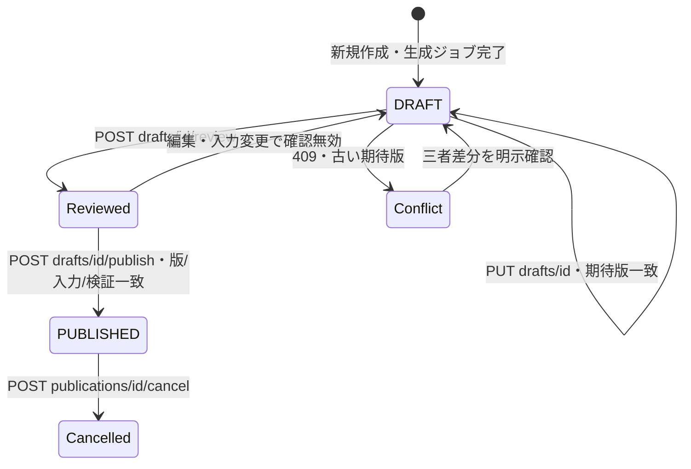
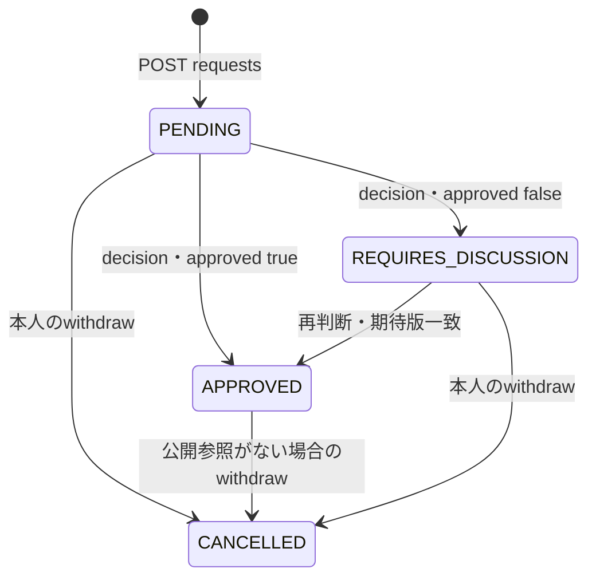
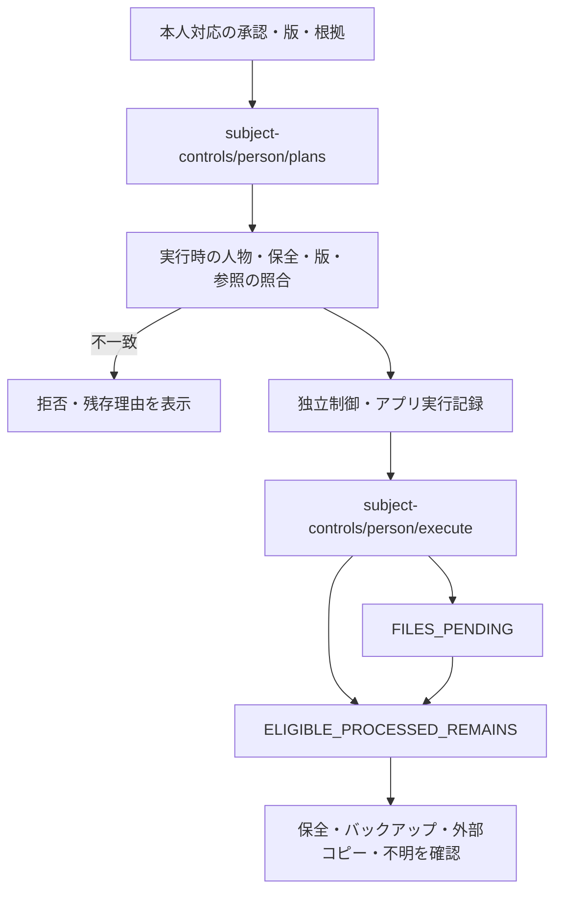
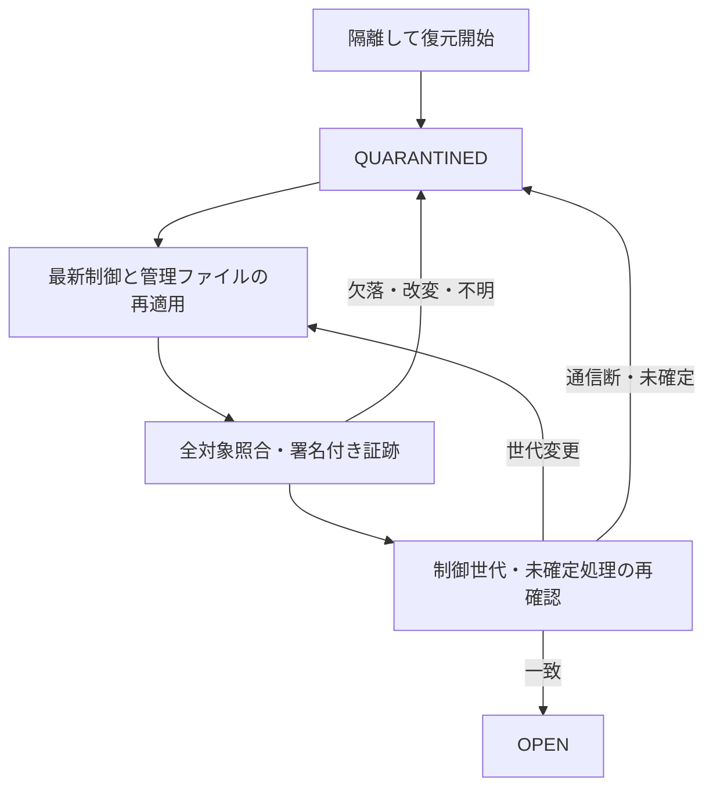
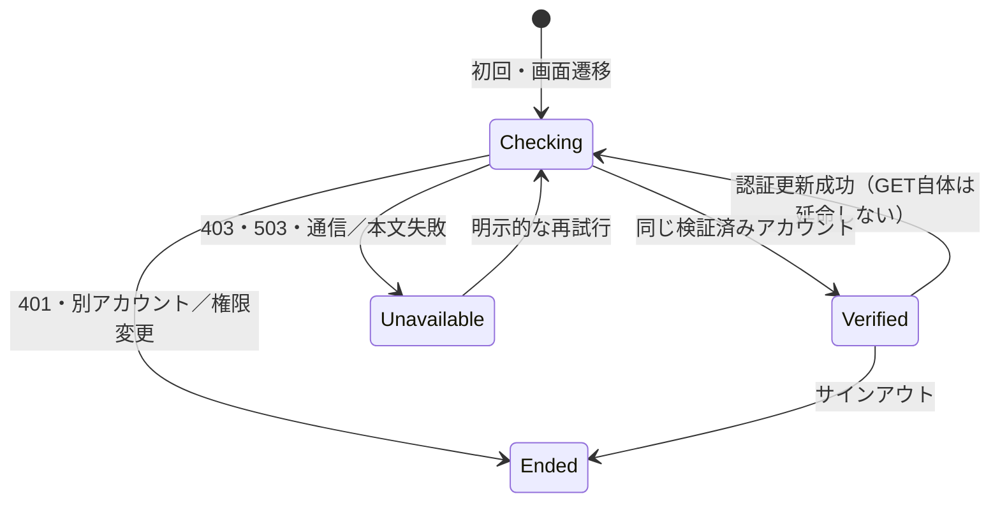

# 業務状態と画面・API・試験の対応

公開資料では、[physical.mmd](physical.mmd) をORMが宣言する物理構造、
[logical.md](logical.md) をJSON内の論理参照として分けている。隔離PostgreSQLの
読取り観測との照合結果は[検証記録](../../ideal-ui/verification.md)に記載する。
当該観測は一つの隔離クラスタを用いるものであり、別ホストへの分離を証明するものではない。

2026-09-28 UI/UX改修。以下はソースに基づく説明図であり、全遷移の形式検証証明ではない。
物理表の図は [physical.mmd](physical.mmd)、JSONの参照は [logical.md](logical.md) である。
観測時の生ログ及び一時的な図は公開リポジトリへ収録せず、公開候補と対応する件数、
差分及びソースハッシュだけを検証記録へ残す。

## 公開と競合

`Reviewed`は画面上の検証状態であり、データベースのstatus値を増設したものではない。
`PlanningWorkspace.tsx` → `/planning/drafts/*` → `application/planning.py`。
`tests/test_planning_retry_api.py`、`tests/test_planning_postgres.py`、`frontend/tests/visual/planning-flow.pw.ts`等の
実行結果は監査台帳で照合する。図にあることだけで試験済みにしない。

## 休暇申請（年休イベント台帳とは別）

公開勤務から参照される申請の変更は`require_unpublished_request`が拒否する。
`PlanningRequests.tsx` → `/planning/requests` → `api/routers/planning.py`。
予約は取得実績ではない。上図は申請の表示に限定し、年休義務管理や付与訂正の法的適合を表さない。

## 人物制御と実行可能分の処理

`SubjectControlWorkflow.tsx` → `/planning/compliance/subject-controls/*` → `application/subject_controls.py`。
`CONTROL_APPLIED_REMAINS`は「全コピー消去完了」ではない。未知自由文を図の矢印だけで自動承認しない。

## 復元の開放

`BusinessWorkflow.tsx`の復旧画面は読取り専用である。実際の復元は運用CLIで行う。
`control/restore_verification.py`と`control/service.py`の検証を図の参照先とする。
PITR、25か月、全辺再生、RPO/RTOの従来の未達は今回のUI試験では変更しない。

## 本人表示の確認状態（2026-09-29）

Checking・Unavailableは、業務入力を保持して非表示・操作不能とする。Endedは旧業務を破棄する。
`GET /auth/me` は署名・失効確認済みのアカウント情報である。`GET /auth/legacy-context` は、施設・部署の範囲（scope）なしの旧API用の、単一所属の職員ID・実効権限である。両者を名前照合で結び付けない。
ヘッダーとサイドバーはIdentityProviderの同じメモリ応答を使用する。データベーススキーマの変更はない。
