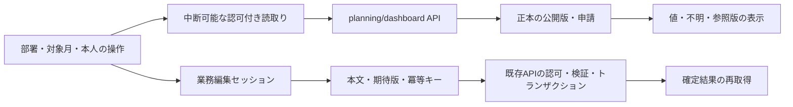
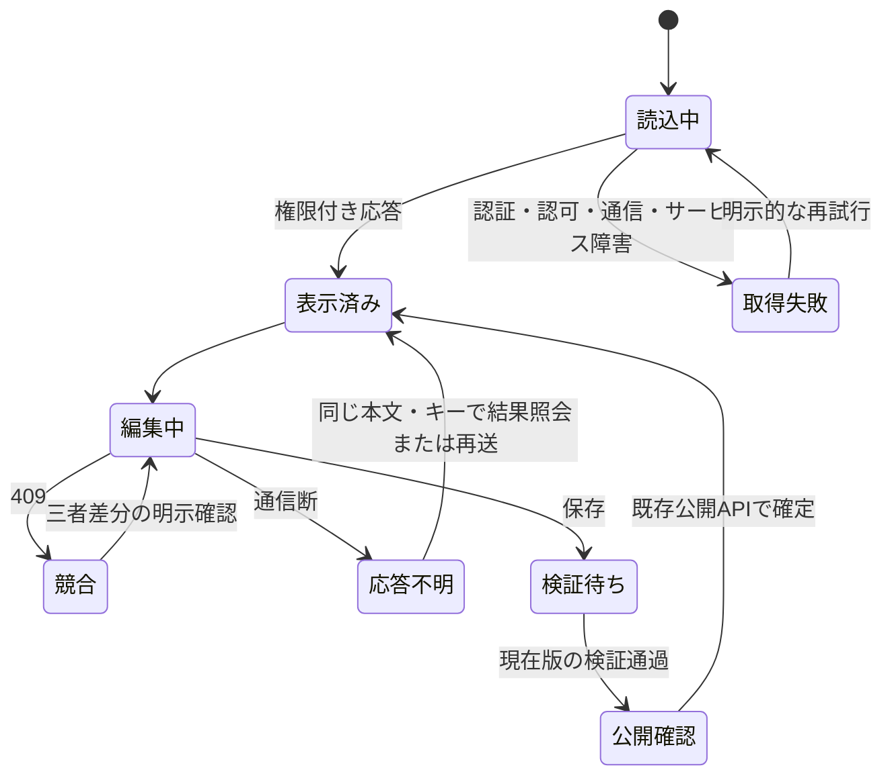
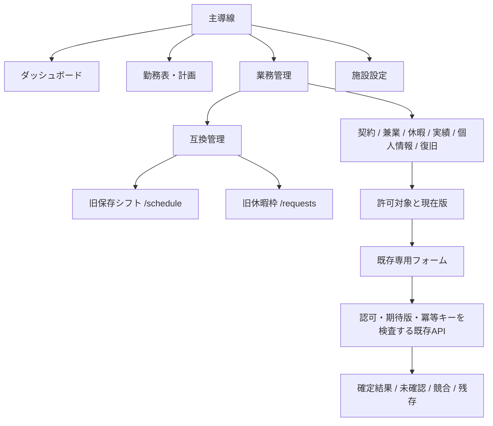

# UI/UXの実装・評価契約（2026-09-28）

## 目的と責務

情報の読みやすさと正確さを優先する。既存URL・認証・生成→確認→公開を維持する。
`components/ui` は視覚部品、業務画面は入力と表示、`lib/planningTransport` は編集単位の通信と同一要求再送、
`lib/planningRead` は中断可能な参照、`lib/apiTarget` は共通接続先を担当する。
法的計算・公開判断は既存バックエンドの責務である。新たなクライアント計算を追加しない。

ダッシュボードは `GET /planning/dashboard?scope_id=…&period=YYYY-MM` を使用する。
既存のpublications/requestsの認可済み読取りから集計し、`role/visibility/observed_at/sources/metrics` を返す。
`metrics` は値・available/unknown・理由からなる。取得不能はnullであり、0ではない。公開期間の件数と本人の勤務件数を区別する。
稼働率、健康影響、法令適合率は算定していない。見本データはStorybookに限定する。

## 状態と配線

消去・復元・休暇の状態機械は、既存ドメインと監査台帳を拠り所とする。本図のみで全遷移検証済みとはしない。
ERは、ORM生成物と実PostgreSQL観測を区別する。アプリ・制御・世代照合（witness）の図は個別に保存し、
サービス間とJSONの参照は物理FKとして示さない。`devtools.er.physical --database-env <変数名> --label app|control|witness --output <新規場所>` は読取り専用である。

公開・休暇・消去・復元の個別図は [業務状態の対応](../architecture/er/workflow-states.md) を参照する。

## 採用根拠と限界及び反対の根拠

|根拠|適用|限界|
|---|---|---|
|[DADS](https://design.digital.go.jp/dads/foundations/typography/)|16 pxを基本、説明と比較表の密度を分離|文字サイズの万人共通の最適値ではない|
|[Piepenbrock 2013](https://www.psychologie.hhu.de/fileadmin/redaktion/Oeffentliche_Medien/Fakultaeten/Mathematisch-Naturwissenschaftliche_Fakultaet/Psychologie/AAP/Publikationen/2013/Piepenbrock-2013-Positive_display_polarity_is_.pdf)|既定は明るい配色、選択肢は保持|ドイツ語の視力・校正課題。日本語勤務編成や視覚障害全般への直接証明ではない|
|[JAMIAの模擬EHR比較](https://pubmed.ncbi.nlm.nih.gov/33566093/)|関連情報を近接して配置|研修医51人の限定課題。効果量を本アプリへ転用しない|
|[WCAG 2.2](https://www.w3.org/TR/WCAG22/)|AAを基準、一連の業務を評価|独自検査は全適合の証明ではない。ターゲットサイズ等の例外とAAAを区別|
|[PPC通則](https://www.ppc.go.jp/personalinfo/legal/guidelines_tsusoku/)|目的限定、権限、合成データ、保存抑止|配色やDB構造を法律が指定しているものではない|
|[Playwright](https://playwright.dev/docs/test-snapshots)|同一ブラウザー・OS・フォントで比較|環境差と機能不良を区別|

## 受入試験とユーザビリティ評価

既存の操作台帳を基準に、役割×操作×正常/空/大量/処理中/エラー/409/未保存/再送を対応づける。
新たな試験が一部に成功した場合であっても、未接続行を成功に変更しない。視覚的検査の打切り・判定不能も未完了として取り扱う。
画像は個別に、文字欠落、主操作、状態の誤認、長文、折返し、フォーカスを確認する。重要領域をマスクしない。
API実通信はメソッド・パス・状態のみ記録し、認証情報と本文を収集しない。静的な経路推測は未確認の候補である。

実拡大200/400%、キーボード完結、実Safari＋VoiceOver、実職員評価は、自動検査とは別個の受入試験である。
初回は3役割各3人の問題発見である。確認試験はAB/BAにより均衡させ、同難度の異なる課題を使用する。
主要指標は、正しい完了・重大誤操作・時間である。予備評価の参加者単位の対数時間差の標準偏差をsとする。
両側5%、検出力80%、10%短縮の人数近似は `ceil(((1.959964+0.841621)*s/log(0.9))^2)` である。
最低24人とし、役割ごとにAB/BAが同数となる6の倍数へ切り上げる。実施に先立ち、脱落見込みと小標本における近似妥当性を再確認する。
10%は製品目標であり、規格・法的閾値ではない。反復課題を独立した参加者として数えず、参加者単位の95%区間を示す。
失敗・中断・欠測を保持する。重大誤操作は修正対象である。観測0件は母集団の危険ゼロではない（[NIST](https://www.itl.nist.gov/div898/handbook/prc/section2/prc241.htm)）。
参加者未確保・精度不足の場合は、有用性や最適性を確定しない。過去の内部評価記録は、個別の作業環境を含むため公開候補には収録しない。公開用の評価票は `docs/ideal-ui/evaluation/` に配置する。

今回のUI結果を25か月故障・全辺API・1,200件性能・施設受入試験の合格へ流用しない。

## セキュリティ照合（ASVS 5.0.0固定）

確認日は2026年9月28日である。以下は変更範囲の対応であり、ASVS全体・特定レベルへの適合認証ではない。

|要件|今回の実装・検査|適用限界|
|---|---|---|
|[v5.0.0-3.2.2 / 3.4.3](https://raw.githubusercontent.com/OWASP/ASVS/v5.0.0/5.0/en/0x12-V3-Web-Frontend-Security.md)|表示文字列はReactのテキスト描画。既存nonce CSPを変更せず`csp.spec.ts`で確認|CSP成功は全XSS経路の証明ではない|
|[v5.0.0-3.5.1–3.5.3](https://raw.githubusercontent.com/OWASP/ASVS/v5.0.0/5.0/en/0x12-V3-Web-Frontend-Security.md)|GET dashboardは読取り専用。更新は既存のOrigin/JSON/認証境界を維持|新たな代理APIを設けず、Cookie/CSRFの責務を移さない|
|[v5.0.0-8.2.1–8.2.3 / 8.3.1](https://raw.githubusercontent.com/OWASP/ASVS/v5.0.0/5.0/en/0x17-V8-Authorization.md)|`access`と既存の本人／部署読取りを使用。`test_dashboard.py`で越境403と本人割当の限定を確認|ボタン表示による認可ではない。本番IdP・人事異動は別個の受入試験|
|[v5.0.0-14.2.2 / 14.2.3 / 14.3.2–14.3.3](https://raw.githubusercontent.com/OWASP/ASVS/v5.0.0/5.0/en/0x23-V14-Data-Protection.md)|no-store、揮発的編集状態、合成データ、ローカル画像・実行台帳|ブラウザー内の状態保持と永続保存は区別。端末の印刷・外部持出しの消去証明にはしない|

これらは技術的な検証基準である。PPCの利用目的・保存義務・本人請求の判断を置換しない。

視覚的検査のフォーカスは、表示中の対象を列挙して未到達を記録する。閉じたdetailsは対象外とし、開いて操作する状態は別ケースとする。規格の[2.4.11（AA）](https://www.w3.org/WAI/WCAG22/Understanding/focus-not-obscured-minimum.html)は、完全な遮蔽を禁止する最低要件である。部分遮蔽を含むAAAや3:1の独自リング検査と同一視しない。[2.5.8](https://www.w3.org/WAI/WCAG22/Understanding/target-size-minimum.html)の間隔・同等操作等の例外は個別審査する。

## 描画の検証記録の読み方

2026年9月28日のビルドはmacOSの隔離作業コピーで作成し、3ブラウザーは固定したLinuxイメージで描画する。
Linuxにおけるクリーン配布ビルドを実施したとは記載しない。ビルド成果物・配布フォント・検査ソースをハッシュ値で固定する。
合成APIの観測時刻とブラウザーの時計を2026-09-28T00:00:00Zに固定するが、業務の法的計算時刻や
ワーカーの処理時間は変更しない。観測時刻の差替えは、mock認証・developmentの隔離ASGI factoryに限り許可する。

フォーカスの到達検査は通常文書又は表示中のmodal dialog/alertdialogを範囲とし、
一時的な終端要素まで移動できたことと、可視対象の未到達ゼロを確認する。
モーダルが背景へTabを出さないこと自体は失敗ではない。内部の不正トラップ、打切り、対象漏れは未完了とする。
終端要素は検査後に除去する。Escape、背景inert、開いた要素への復帰は別個の操作試験により確認する。
本補助検査は全キーボード経路や支援技術の証明ではない。

## 全画面のIA（2026-09-29）

今回追加した `devtools/visual/build.mjs --linux` は既存の固定イメージによりLinuxビルドを作成する。
ブラウザーも固定Linuxイメージである。現行のHTTPS配信プロセスはmacOS Nodeであり、全サービスのLinux稼働とは区別する。
画像比較は改修前ソースからも同じLinuxビルドを作成した別系列に限定する。

主導線は `lib/navigation.ts` のダッシュボード／勤務表・計画／業務管理／施設設定である。
旧 `/schedule` と `/requests` はURLを保持し、業務一覧の「互換管理」に配置する。
公開勤務と旧保存記録、年休の請求・予約・実取得・義務、人物制御と全コピー消去を混同しない。

業務ページは目的・対象 → 選択 → 詳細・根拠 → 許可された操作 → 結果の順である。
契約と実績は、広幅で一覧と詳細を並列に表示し、狭幅で同一のフォームを縦に表示する。
別画面実装や複製された法的計算を作成しない。主要な業務への画面内リンクはアンマウントせず、
三者差分・未保存値・冪等キーを保持する。破壊的操作は既存の確認・権限制御を経由する。

旧休暇枠はグローバル役割で、LEADERは参照のみ、ADMIN / DEVELOPERは既存APIの更新範囲である。
業務ページは部署所属の役割により判定し、DEVELOPERを部署ADMINへ変換しない。
表示用Cookie・リンクは認可の根拠ではなく、APIが最終判定する。

操作・ルートの原本は、既存 `audit/integrated-acceptance-2026-09-23-r1/workflows/operation-matrix.json` である。
42操作の結果を上書きせず、screenとadditional_surfacesの対応を同台帳へ追加した。
全状態の実行を確認していない行は、acceptance_pendingを維持する。

### 根拠と適用範囲

- [DADSタイポグラフィ](https://design.digital.go.jp/dads/foundations/typography/)：本文16 pxを基本、比較表の密度は用途別。万人共通の最適値ではない。
- [JAMIA 2021](https://pubmed.ncbi.nlm.nih.gov/33566093/)：模擬EHRの問題別情報集約。勤務表へ効果量を外挿しない。
- [PeerJ 2019](https://pubmed.ncbi.nlm.nih.gov/30809464/)：331人の課題で外観と時間・正確さの改善は一致しなかった（確認範囲は著者抄録）。有意差なしを無効果の証明としない。
- [WCAG 2.2](https://www.w3.org/TR/WCAG22/)：完全な手続、リフローの二次元表例外、AAとAAAを区別。[自動評価の限界](https://www.w3.org/WAI/test-evaluate/tools/selecting/)を保持。
- [PPC通則編](https://www.ppc.go.jp/personalinfo/legal/guidelines_tsusoku/)：利用目的・安全管理・アクセス制御と照合。特定UIを法定方式としない。
- [厚労省・年5日管理](https://www.mhlw.go.jp/content/001140963.pdf)：半日と時間年休の意味を混同しない。UIに法的計算を再実装しない。

実職員の有用性評価は未実施である。各役割3人の問題発見と、AB/BAの比較評価を別段階とする。
反復課題を独立した参加者として数えず、失敗・中断・欠測を保持する。
最低24人は運用上の下限であり、精度・検出力を保証する人数ではない。
観測ゼロの誤操作も母集団の危険ゼロとしない（[NIST比率推定](https://www.itl.nist.gov/div898/handbook/prc/section2/prc241.htm)）。

### 今回の実装判断と限界及び反対の根拠

- セクション切替は、初期状態では文書内リンクを採用する。フォームを非表示／再生成するタブを追加した場合、未保存値や再送キーを喪失する可能性がある。このことから、既存の編集セッションを維持する。スクロール距離が最適であるか否かは未評価である。
- 明示された別部署リンクは現在の部署で上書きしない。部署・期間は表示文脈であり、許可の根拠ではない。APIから返却される所属と権限が操作範囲を決定する。
- 旧休暇枠は現行の年休計算から分離する。取得失敗・読込み中に残数ゼロを示さない。応答が逆順の場合であっても、以前の月の値を現在の月に表示しない。
- 密な比較表は必要な最小幅を維持し、説明付きのキーボード操作可能な横スクロール領域とする。WCAG二次元表の例外は、狭幅で一文字ずつ改行する見出しを推奨する根拠ではない。
- 画像の重なり検査が成功した場合であっても、説明内容の誤りや関連情報の離隔は検出できない。今回それらが第三者的レビューにより検出された事実を、自動検査の限界として記録する。

## 本人・権限・状態の意味契約（2026-09-29）

本人欄は `GET /auth/me` の表示名と識別子を使用する。localの識別子は「ログインID」、OIDCのアプリ内識別子は「アカウントID」とする。表示名欠損は「表示名未登録」とし、権限名・認証状態を名前として補完しない。display Cookieは表示・認可の拠り所としない。

全体権限、部署所属権限、本人との関係は別個の概念である。部署のADMINは「部署管理者」、LEADERは「部署責任者」、STAFF/PHARMACISTは「部署職員」とする。施設・部署の範囲（scope）なしの旧APIに限り、`/auth/legacy-context` が単一所属をperson_id/effective_roleへ対応づける。複数所属は従来どおり拒否する。この拒否をアカウント本人確認失敗として表示しない。

本人確認の読取りはセッションを更新しない。確認中と確認不能の間は、業務内容を保持したまま非表示・操作不能とする。認証終了やアカウント変更の場合は旧業務を破棄する。署名・失効・制御サービスの検査はAPI側に維持する。

年休取得義務の `fulfilled`、`overdue`、`at_risk` はAPI結果を翻訳するにとどめ、未知値を正常・不足見込みへ補完しない。期間、半日単位からの日表示、付与主体は別項目として保持する。

既存操作台帳の `semantic_audit` は、概念・原本・対象・時点版・単位・状態・許可操作・試験を照合するための欄である。本人表示の成功を、その操作の全業務意味の受入へ読み替えない。

年間区分期間の同意は、状態・資料名・確認責任者・時差付き期限を別入力とする。文字列の区切りや空白を正規化して証拠本文を変更しない。日数・時間量は整数で保持し、三者差分には各期間の資料と期限まで表示する。UIの構造検査は法的公開可否の再計算ではない。
